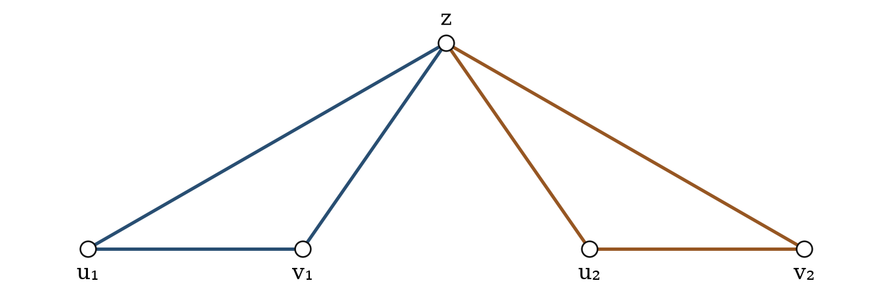

# Clique partitions of chordal graphs: mixed rounding and construction in the critical regime

**Juan Pablo Traverso Gianini**  
Independent researcher, Santiago, Chile  
[jtraverso@gmail.com](mailto:jtraverso@gmail.com)  
[ORCID: 0009-0003-6068-4096](https://orcid.org/0009-0003-6068-4096)

**Paper IV in the series**  
**Preprint:** version 0.8, English draft for the author's review.  
**Date:** September 21, 2026.  
**Status:** research draft for review. A local source snapshot with SHA-256 hashes and reproduced audits is included; a permanent public commit and link remain to be assigned.

**MSC 2020:** Primary 05C70; secondary 05C35, 05C72.

## Abstract

The clique partition number \(\operatorname{cp}(G)\) is the minimum number of cliques whose edges partition \(E(G)\) exactly; we write \(c_r(G)\) when each piece has at most \(r\) vertices.

We prove that every chordal graph of order \(n\) admits a partition into cliques of order at most four with at most \(M(n)+b\) pieces, where \(b\) is an absolute constant, not evaluated here, and
\[
M(n)=\left\lfloor\frac{n(n+1)}6\right\rfloor.
\]
For sufficiently large orders the bound is \(M(n)\), and this value is the exact maximum of the clique partition number among chordal graphs of that order. The bound for every \(n\) implies \(n^2/6+O(n)\), as requested in the problem of Erdős, Ordman and Zalcstein.

The proof continues the study of profiles, fractional extrema and split partitions in Papers I–III. It reuses the nibble from Paper III to round mixed gain when the fractional value leaves a quadratic margin. In the critical regime, a descent along vertex-copy steps locates a root; a construction on the original graph yields the partition. Its accounting gives quantitative stability: an integral deficit of at most \(\delta\), sufficiently small relative to \(n^2\), allows the graph to be transformed into a complete-split graph by at most \(20\delta\) edge edits. We also obtain the eventual classification of extremizers. The conclusion bounds \(c_4\), not just the unrestricted number \(\operatorname{cp}\). The final Lean statements invoke the proved components rather than taking them as additional hypotheses; the audit also checks that the namespace of the formal development [5] is absent from their transitive dependencies. This check of the formal proof chain is distinct from a claim of bibliographic priority.

**Keywords:** chordal graph; clique partition; mixed packing; fractional rounding; complete-split graph; mathematical formalization.

## 1. Introduction

A clique partition of a graph \(G\) is a family of cliques whose edge sets are disjoint and whose union is \(E(G)\). We write \(\operatorname{cp}(G)\) for the smallest number of pieces. Vertices may belong to several pieces; edges may not. For \(r\ge2\), we denote by \(c_r(G)\) the minimum when every piece has order at most \(r\).

The problem of Erdős, Ordman and Zalcstein [1,8] asks for a bound of the form \(n^2/6+O(n)\) for chordal graphs. Complete-split examples explain the quadratic coefficient. A fractional bound of this order, however, does not immediately yield a partition with linear error: general rounding allows a subquadratic loss, which may be much larger than \(n\).

The three preceding papers in the series separate aspects of this difficulty. Paper I [2] studies neighborhood profiles relative to a split presentation and reduces the residual problem to a fixed polytope. Paper II [3] determines the exact maximum of the fractional triangle deficit over all chordal graphs by vertex copying. Paper III [4] constructs partitions with linear error for split graphs, distinguishing the regimes in which the fractional margin suffices from those requiring a more precise construction. Its formal development also supplies the nibble and rounding infrastructure reused in Section 3 and Appendix B.

This work is part of that series: its inputs are stated where they are applied. There are also the public preprint [5] and that of Okechukwu [15], whose Corollary 1.2 obtains the additive bound and eventual maximum for chordal graphs as a special case of a larger class. The present formal proof chain does not logically depend on the results of those works. Its contribution is presented through the verified proof, weighted rounding and quantitative accounting in the critical regime, not as a priority claim for the bound. Section 8 distinguishes the mechanisms and the scope of the comparisons.

The formulation in [8] asks: “Can the edges of \(G\) be partitioned into \(n^2/6+O(n)\) many cliques?”, for chordal \(G\). Erdős, Ordman and Zalcstein [1] had proved a bound \((1/4-\epsilon)n^2\), with a small positive constant \(\epsilon\). Theorem A gives the requested form for every order.

Here we extend the distinction between margin and construction to chordal graphs, using a mixed model of triangles and \(K_4\). The second type of piece has six edges and replaces six individual pieces by one. Its gain is therefore five, whereas a triangle's gain is two. These gains must be retained during rounding. Preserving only the number of copies does not preserve the cost of the partition.

### Theorem A. Bound for all orders

There is an absolute constant \(b\in\mathbb N\) such that, for every \(n\ge0\) and every chordal graph \(G\) of order \(n\),
\[
\operatorname{cp}(G)\le c_4(G)\le M(n)+b
\le\frac{n^2}{6}+\frac n6+b.
\tag{A}
\]
Consequently, there exists \(C\ge0\) such that \(c_4(G)\le n^2/6+Cn\) for all these graphs. This last assertion answers Erdős Problem 81 [1,8]; there are no exceptions in the order. The additive constant \(b\) is not claimed to be optimal.

### Theorem B. Sharp bound and eventual maximum

There is an integer \(N\) such that every chordal graph \(G\) of order \(n\ge N\) admits a partition into cliques of order at most four with at most \(M(n)\) pieces. In particular,
\[
\operatorname{cp}(G)\le c_4(G)\le M(n).
\tag{1.1}
\]
For the same orders, increasing \(N\) if necessary,
\[
\max_{\substack{|V(G)|=n\\G\text{ chordal}}}\operatorname{cp}(G)=M(n).
\tag{1.2}
\]

The second assertion follows from the upper bound and a complete-split witness whose optimality is proved against all clique partitions, not merely those of bounded order. This argument alone does not classify all extremal graphs. Theorem B is more precise than the bound requested in the problem; Theorem A states its consequence valid for every order.

The example that fixes the scale is explicit: for \(n\ge6\), take \(k=\lceil n/3\rceil\), \(h=n-k\) and \(S=K_k\vee I_h\). Eliminating the independent hosts first and then the core gives a perfect elimination ordering, so \(S\) is chordal. Using one core base per triangle yields a partition of cost \(kh-\binom k2=M(n)\); the weight argument in §6.1 shows that no partition, even one with larger cliques, costs less.

### 1.1. The common condition: a loss budget

Let \(W^*(G)\) be the optimal fractional mixed gain from triangles and \(K_4\), with gains two and five. Write
\[
F_4(G)=e(G)-W^*(G),\qquad \Delta(G)=M(n)-F_4(G).
\]
For a physical packing \(\mathcal P\) of gain \(g(\mathcal P)\), completing the uncovered edges as individual pieces costs exactly \(e(G)-g(\mathcal P)\). Hence
\[
\boxed{
e(G)-g(\mathcal P)\le M(n)
\quad\Longleftrightarrow\quad
W^*(G)-g(\mathcal P)\le\Delta(G).
}
\tag{1.3}
\]
The inequality on the right has a direct interpretation. The quantity \(W^*(G)-g(\mathcal P)\) measures the gain lost in passing from the fractional optimum to the constructed packing; \(\Delta(G)\) measures the margin left by that optimum relative to \(M(n)\). If the loss does not exceed the margin, the completed partition has at most \(M(n)\) pieces. We call this comparison the **loss budget**. The identity does not specify how to choose \(\mathcal P\): it can be used to check any construction of edge-disjoint copies.

The accounting has a form independent of the mixed model. Let \(Q\) be any clique partition, with pieces of order at least two, and define its total gain by
\[
g(Q)=\sum_{K\in Q}\left(\binom{|K|}{2}-1\right).
\]
Exact coverage and edge-disjointness give, for any target \(T\),
\[
g(Q)+|Q|=e(G),\qquad
|Q|\le T\quad\Longleftrightarrow\quad e(G)\le g(Q)+T.
\tag{1.3a}
\]
No bound on the order of the pieces has been used. In particular, \(K_2\) pieces have zero gain and may be retained in the sum or added when completing a packing. This is the identity formalized in `LossBudget.budget_iff`; for large pieces one uses the ordinary gain, not the capped function of the mixed model.

To compare families, fix a set \(S\subseteq\{3,\ldots,n\}\) of allowed orders. Let \(W_S^*(G)\) denote the maximum fractional gain with these pieces, \(F_S(G)=e(G)-W_S^*(G)\) the fractional cost, and \(\Delta_S(G)=M(n)-F_S(G)\) its margin. Capacities remain one per edge. Extending a packing by zero shows that, if \(S\subseteq S'\), then \(W_S^*\le W_{S'}^*\) and \(\Delta_S\le\Delta_{S'}\). For \(4\le L\le n\), this gives
\[
\Delta_{\{3,4\}}(G)\le\Delta_{\{3,\ldots,L\}}(G)
\le\Delta_{\mathrm{cp}}(G),
\tag{1.3b}
\]
where the last term permits every order up to \(n\). With the same convention, \(c_4(G)\ge c_L(G)\ge\operatorname{cp}(G)\). The margin inequalities need not be strict. Moreover, for a fixed construction, enlarging \(S\) increases both the optimum against which the loss is measured and the margin: the advantage is the availability of more admissible constructions, not an automatic improvement in the balance.

Thus (1.3) is the mixed case of a general accounting identity. The difficulty remains to produce a construction satisfying it for every chordal graph. The following structural result provides this coverage for our family of pieces.

We prove that uniform rounding RC01 produces a loss smaller than the margin in the far regime. In the critical regime, descent locates a root and the H1/RD09 construction produces \(\mathcal P\) directly in \(G\), without selecting a first-entry index. Its physical accounting, developed in Section 5, proves
\[
e(G)-g(\mathcal P)
\le B_n(p)-\frac m{20}-\frac A2
\le M(n),
\tag{1.4}
\]
and (1.3) gives the required budget.

We fix three terms. The **margin** is \(\Delta(G)\); the **loss** is \(W^*(G)-g(\mathcal P)\). **Selector slack**, by contrast, refers to unused capacity in an auxiliary fractional packing. It does not require a lower bound on loads and should not be confused with the graph's margin.

### 1.2. Structural dichotomy and resolution mechanisms

**Structural dichotomy.** For \(\eta_0=10^{-16}\) and every sufficiently large chordal graph,
\[
\boxed{
F_4(G)<\frac{n^2}{6}-\eta_0n^2
\quad\text{or}\quad
\exists\,\text{near-structure witness for }G.
}
\tag{1.5}
\]
The witness includes a complete-split comparator, a root that is a clique of \(G\), and a packing of the original graph with its physical accounting. The alternatives are exhaustive; the existence of the witness is not asserted to be incompatible with a quadratic margin. This is not merely a metric condition: it retains the resources needed to complete the partition. Appendix A identifies the formal declaration of the dichotomy.

In the first branch, mixed rounding produces a loss smaller than the available margin in (1.3). In the second, the constructor's accounting verifies the target directly. The packing, its feasibility and the accounting inequality suffice for the conclusion. The near witness also retains the structure that produces them.

Figure 1 follows only our proof. To connect the diagram to the text, we call the far case **branch L**: Theorem 3.1 performs rounding and Corollary 3.5 pays for its loss. **Branch C** is the critical case: Proposition 4.3 locates the comparator, Section 5 constructs in \(G\), and Lemma 5.3 pays for the losses. Both branches end in Theorem B; Section 6.3 extends its conclusion to every order and proves Theorem A. The letters L and C denote the two cases of a single proof.

This proof has two refinements with different roles. The **hybrid form** retains the `NearStructureWitness`, namely the root, comparator and accounting; it is described in Section 5.4 and yields the stability result of Section 6.5. The **model bridge** preserves resources and gains when changing the formal representation of pieces; it is documented in Section 7.2. This bridge acts at the model level, not after Theorem B or as another stabilization mechanism.


### 1.3. Organization and use of chordality

**Remark 1.1.** The rounding branch applies to arbitrary graphs. The critical branch uses chordality at three distinct points: the existence and preservation of the copy steps in §4.1; clique extraction and the absence of induced squares in §5.1; and the perfect elimination ordering that orients exterior edges in §5.3. The elimination ordering also certifies that the examples attaining the bound are chordal. None of these properties follows solely from the numerical budget inequalities.

Section 2 fixes the model. Section 3 states the rounding result and explains its use; Appendix C develops its technical proof. Sections 4 and 5 establish localization and the critical construction. Section 6 assembles the proof and derives stability, classification and exact values. Section 7 summarizes the formal scope; Appendix A gives the declarations and their correspondence. Section 8 compares the mechanisms with [5,15]. Appendix B collects complementary tools.

Under the current numbering of the series, the general transfer engine is reserved for Paper V. References to that engine as “Paper IV” in earlier versions of [2–4] belong to the former plan, not to an additional dependency of the present result.

## 2. Mixed gain, duality and partitions

All graphs are finite, simple and undirected. A clique is identified with its vertex set; its edges are all pairs of distinct vertices in that set. A graph is chordal if it has no induced cycle of length at least four. Induced subgraphs of a chordal graph are chordal.

### 2.1. Why gain is the quantity to round

Let \(\mathcal K(G)\) be the family of cliques of order three or four. A mixed packing is a subfamily \(\mathcal P\subseteq\mathcal K(G)\) of edge-disjoint copies. Define
\[
g(K)=\binom{|K|}{2}-1,\qquad
g(\mathcal P)=\sum_{K\in\mathcal P}g(K).
\]

| Piece | Edges covered | Pieces replaced | Gain |
|:--|--:|--:|--:|
| \(K_2\) | 1 | 1 | 0 |
| \(K_3\) | 3 | 3 | 2 |
| \(K_4\) | 6 | 6 | 5 |

**Table 1.** Cost is measured relative to covering each edge separately.

### Lemma 2.1

Let \(Q\) be the partition obtained by adding to \(\mathcal P\) every uncovered edge as a \(K_2\) piece. Its number of pieces is exactly
\[
|Q|=e(G)-g(\mathcal P).
\tag{2.1}
\]
**Proof.** The pieces of \(\mathcal P\) cover \(\sum_K\binom{|K|}{2}\) edges, since they do not overlap. There remain \(e(G)-\sum_K\binom{|K|}{2}\) individual edges. Adding the initial \(|\mathcal P|\) pieces gives (2.1). Coverage is exact by construction.

### 2.2. The fractional optimum and its certificate

A fractional packing assigns a weight \(x_K\ge0\) to each actual copy \(K\), with
\[
\sum_{K:e\in E(K)}x_K\le1\qquad(e\in E(G)).
\tag{2.2}
\]
Its value is \(w(x)=\sum_K g(K)x_K\), and \(W^*(G)\) is the maximum of these values. The dual assigns prices \(y_e\ge0\) to edges. For each triangle \(T\) and each \(K_4\), denoted by \(Q\), it requires, respectively,
\[
\sum_{e\in E(T)}y_e\ge2,\qquad
\sum_{e\in E(Q)}y_e\ge5.
\tag{2.3}
\]
The zero vector is primal feasible. Every primal coordinate is bounded by one, since every copy contains an edge. Finite duality supplies primal and dual optima of equal value. The formal model uses rational data and constructs both optima: the value \(w\) is not an assumption without a witness. Paper I [2, Appendix B] provides the antecedent of packing–covering duality; the rational development used here proves its version by Fourier–Motzkin elimination.

Summing capacities in (2.2) also gives
\[
w(x)\le\frac56\sum_K |E(K)|x_K\le\frac56e(G).
\tag{2.4}
\]
This estimate controls the cost of scaling a packing down multiplicatively. It is not, by itself, the chordal extremal bound.

### 2.3. Relation to the earlier functionals

Extending a triangular packing by zero gives
\[
W^*(G)\ge2\nu_3^*(G),\qquad
F_4(G)\le e(G)-2\nu_3^*(G).
\tag{2.5}
\]
Paper II [3, Theorem 1.1] bounds the second quantity by
\(\lfloor(2n+1)^2/24\rfloor\). For integer \(n\) this floor equals \(M(n)\): the product \(n(n+1)\) is congruent to 0 or 2 modulo 6, and adding \(1/24\) does not cross an integer. This explains the target of the series. Passing from that fractional value to a partition still requires the two branches developed below.

### 2.4. Notation for the two branches

| Symbol | Meaning |
|:--|:--|
| \(M(n)\), \(B_n(p)\) | Integer target and complete-split profile |
| \(W^*(G)\), \(W(G)\) | Optimal fractional and integral mixed gains |
| \(g(\mathcal P)\) | Gain of the chosen physical packing |
| \(F_4=e-W^*\), \(\Delta=M-F_4\) | Fractional cost and margin to the target |
| \(W_S^*,F_S,\Delta_S\) | The same quantities for a family of orders \(S\), only in §§1.1 and 8 |
| \(C,P,R\) | Comparator core, extracted clique and regularized root |
| \(a,p,q\) | \(|P|,|R|,n-|R|\) |
| \(m,A\) | Exterior edges and missing links relative to \(R\) |
| \(f,\ell\) | First-phase triangles and failed second-phase bases |
| \(d(G)\) | Normalized edit distance to the complete-split family |

The auxiliary symbols for the selector in Appendix C are defined there. In particular, \(\ell\) in §5 is a failure count, not a gain.

## 3. Mixed rounding and the regime with margin

This is branch L in Figure 1. Its input is a fractional packing; its output is a physical packing with uniformly subquadratic loss. Corollary 3.5 explains when this loss fits within the available margin.

### Theorem 3.1

For every rational \(\xi>0\), there exists \(N_\xi\) such that, for every graph \(G\) of order \(n\ge N_\xi\) and every rational fractional mixed packing \(x\), there is a mixed packing \(\mathcal P\) with
\[
w(x)-g(\mathcal P)\le\xi n^2.
\tag{3.1}
\]
Chordality is not required. The threshold is chosen after \(\xi\), but before \(G\), \(n\) and \(x\).

This is a uniform transfer of weighted gain. The theorems of Haxell–Rödl and Yuster [6,7] provide the context of fractional-to-integral transfer. We specify below the input from Paper III and the two-quota adapter that preserves gains two and five.

**Proof structure.** The bounded-rank lemma of Paper III, reproduced as Lemma 3.2 in Appendix C, rounds a family with loads at most one and sufficiently small codegree. By itself, it does not distinguish gains two and five. Lemma 3.3 adds marks and obtains two quotas for the same matching; Lemma 3.4 groups pairs of triangles and marks the \(K_4\) copies, so that the gain is recovered as four times the total quota plus the marked quota.

To apply that selector to an arbitrary graph, a regular partition and profile cleanup produce a system with controlled loads and codegrees. Removed mass is charged to its resources only once. First \(\xi\) is fixed, then the selector and regularity parameters, and only at the end the threshold \(N_\xi\), independently of the instance. The case of small triangular mass is treated separately. Appendix C retains the full estimates and parameter hierarchy; its numbering 3.2–3.14 belongs to the proof of this theorem.

Thus Theorem 3.1 is not cited as a black box from Paper III. That paper supplies the nibble; two-quota selection, its mixed realization and the uniform assembly are the steps of Paper IV. The fully proved statement (3.1) is all that is used below.

### Corollary 3.5

For a fixed rational \(\eta>0\), every sufficiently large graph with
\(F_4(G)<n^2/6-\eta n^2\) admits a partition of order at most four with at most \(M(n)\) pieces.

**Proof.** Apply Theorem 3.1 to a rational optimum with \(\xi=\eta/2\). Lemma 2.1 gives
\[
c_4(G)\le e(G)-g(\mathcal P)
\le F_4(G)+\frac\eta2n^2
<\frac{n^2}{6}-\frac\eta2n^2.
\]
For \(n\ge6\), the inequality \(\lfloor t\rfloor\ge t-1\) gives \(M(n)\ge n(n+1)/6-1\ge n^2/6\). The conclusion follows by increasing the threshold if necessary.

The argument does not require a universal linear bound on \(W^*(G)-W(G)\). It only requires the loss to be smaller than the margin of the instance.

## 4. Localization of the critical regime

We begin branch C of Figure 1. Proposition 4.3 locates a complete-split comparator. Section 5 converts this information into a partition of the original graph.

As in the formal development, fix
\[
\varepsilon_0=10^{-12},\qquad \eta_0=10^{-16}.
\tag{4.1}
\]
The near threshold has been reduced from \(10^{32}\) to \(2\cdot10^{13}\). It applies to localization and the near constructor, not to the entire proof: the rounding in Section 3 may impose a larger threshold. This improvement does not yield a global threshold of \(2\cdot10^{13}\).

### 4.1. Distance to a fixed family

For graphs on the same vertex set, let
\(d_E(G,H)=|E(G)\mathbin{\triangle}E(H)|\).
Consider the family of all labelled complete-split graphs
\(S_C=K_C\vee I_{V\setminus C}\), and define
\[
d(G)=\frac1{n^2}\min_C d_E(G,S_C).
\]
The minimum is attained because the family is finite. The triangle inequality implies
\[
|d(G)-d(H)|\le\frac{d_E(G,H)}{n^2}.
\tag{4.2}
\]
A vertex-copy step changes at most \(n-1\) edges. Thus the change in \(d\) in one step is at most \(1/n\). This bound does not require the distance to decrease along the whole path.

Paper II [3] explains the mechanism of copying simplicial classes and termination at a complete-split graph for the triangular functional. The mixed development requires its own value transports and ends at a graph in the same family. Admissible copies preserve chordality; the mixed bound does not follow simply by renaming the triangular functional.

**Lemma 4.1 (admissible mixed path).** Every chordal graph \(G\) admits a finite sequence \(G=G_0,\ldots,G_\ell\) on the same vertex set such that \(G_\ell\) is complete-split, every \(G_i\) is chordal, each step copies a single nonadjacent simplicial vertex, and
\[
F_4(G_i)\le F_4(G_{i+1}),\qquad
d_E(G_i,G_{i+1})\le n-1.
\tag{4.3}
\]

**Proof.** For two nonadjacent simplicial vertices \(u,v\), consider the two opposite copies \(G_{u\to v}\) and \(G_{v\to u}\). Mixed packing transport gives
\[
W^*(G_{u\to v})+W^*(G_{v\to u})\le2W^*(G).
\tag{4.4}
\]
This is the mixed version of the transport in Paper II. Both packings are transported to the original graph and averaged with weight \(1/2\). A link may receive load from pieces transported from both endpoints; the preliminary bound is load at most two, not one. Averaging restores capacity one and also divides the sum of gains by two. The sum of the edge counts of the two copies is \(2e(G)\). Subtracting (4.4) gives \(2F_4(G)\le F_4(G_{u\to v})+F_4(G_{v\to u})\); at least one direction does not decrease \(F_4\).

It remains to show that a step always exists outside the terminal family and that steps do not repeat. Call two vertices twins if they have the same open neighborhood. If every nonadjacent simplicial pair were twins, Dirac's theorem would supply, in the noncomplete case, a pair \(x,y\) with a common neighborhood \(C\), which is a clique. The exterior of \(C\) is independent: if it had a component containing an edge, the rooted form of Dirac's theorem would give a simplicial vertex of the graph in that component. Its neighborhood would have to be \(C\), contradicting the presence of a neighbor in the component. Every exterior vertex is therefore simplicial and, by the condition on pairs, has neighborhood exactly \(C\). Hence the graph is \(K_C\vee I_{V\setminus C}\). The complete case is already terminal. Taking the contrapositive gives the two distinct classes required for a step.

Now count ordered pairs of distinct twins. Let \(t\le s\) be the sizes of the two classes, and copy a vertex from the smaller class toward the larger one. Among vertices not copied, no equality of neighborhoods is destroyed: all undergo the same substitution in the coordinate of the copied vertex. At most \(2(t-1)\) pairs containing it are lost and \(2s\) are gained, so the increase is at least \(2(s-t+1)>0\). If this direction does not decrease \(F_4\), it lexicographically increases the pair consisting of \(F_4\) and this count. If it decreases \(F_4\), (4.4) forces the reverse direction to increase it strictly; that too increases the pair. There are only finitely many labelled graphs on \(V\), so the process terminates.

Finally, deleting the vertex to be copied leaves a chordal induced subgraph. Reinserting it with the source's clique neighborhood adds a simplicial vertex; any cycle through it of length at least four has the chord between its two neighbors. Chordality is therefore preserved. Only edges incident to the copied vertex change, at most \(n-1\). This proves (4.3).

**Lemma 4.2 (accounting inside the window).** If \(X\) is chordal, \(n\ge2\cdot10^{13}\), \(F_4(X)\ge n^2/6-\eta_0n^2\) and \(d(X)<\varepsilon_0\), then
\[
d(X)\le20D/n^2,\qquad D=\eta_0n^2+n/6+1/24.
\tag{4.5}
\]

**Proof.** Apply Theorem 5.0, whose hypotheses include proximity and whose proof does not use Proposition 4.3. It gives a clique root \(R\) and a partition \(Q\) with
\[
F_4(X)\le |Q|\le B_n(|R|)-m/20-A/2
\le (2n+1)^2/24-m/20-A/2.
\]
The first inequality holds because the fractional optimum dominates the gain of the physical packing. Subtracting the assumed lower bound on \(F_4(X)\) gives \(m+10A\le20D\). Since \(R\) is a clique, \(d_E(X,S_R)=m+A\le20D\), proving (4.5). This lemma uses the **local construction under proximity**, not global localization: the latter is proved next using the lemma. This separation prevents a circular dependency.

### 4.2. Descent from the terminal graph

The localization argument can be viewed as backward induction. Suppose \(G_0,\ldots,G_\ell\) is an admissible path and \(G_\ell\) is complete-split. Its distance is zero. The local accounting estimate ensures that, within the window \(d(X)<\varepsilon_0\), graphs on the path with the required fractional value satisfy
\[
d(X)\le\frac{20D}{n^2}<\frac{\varepsilon_0}{4},\qquad
D=\eta_0n^2+\frac n6+\frac1{24}.
\tag{4.6}
\]
The calibration verifies the last inequality for \(n\ge2\cdot10^{13}\).

Specifically, the inequality to check is
\[
\frac{10}{3n}+\frac{5}{6n^2}<\frac{\varepsilon_0}{4}-20\eta_0
=2.48\cdot10^{-13}.
\tag{4.6a}
\]
The first term explains the scale: omitting only the positive term of order \(n^{-2}\) gives the reference value \(10/(3\cdot2.48\cdot10^{-13})\), approximately \(1.3441\cdot10^{13}\). Substituting \(n=2\cdot10^{13}\) satisfies the full inequality, and the left-hand side decreases with \(n\). This is a sufficient condition for the calibration, not a lower bound for every possible method.

If \(d(G_{i+1})<\varepsilon_0/2\), then (4.2) gives
\[
d(G_i)<\varepsilon_0/2+1/n\le\varepsilon_0.
\]
We may now apply (4.6) to \(G_i\), returning it to the interval \(d(G_i)<\varepsilon_0/2\). Repeat this step back to the original graph. The argument uses an outer window and an inner contraction; it does not require selecting the first index that crosses a threshold.

This induction does not eliminate the local stability estimate (4.6). It identifies precisely the input that replaces first-entry selection by descent. Monotonicity of the fractional value preserves the numerical hypotheses even when the distance oscillates.

The same propagation can be proved by deleting the last step and inducting on the path length. These are two proofs of the localization lemma, not two additional global solutions. Neither requires selecting a minimum index.

The near threshold reflects the interaction of two scales: removing \(u\) vertices from the comparator costs at most \(un\), whereas chordal accounting controls \(u(u+1)/2\) by the number of edits. A parameterized version takes a budget \(a^2/B\) with \(B\ge1\), a bound \(a\ge\alpha n\) with \(0<\alpha\le1\), and \(\eta\ge0\). The conditions
\[
\varepsilon=\frac{\alpha^4}{8B^2},\qquad
1280B^2\eta\le\alpha^4,\qquad
n\ge\frac{1280B^2}{\alpha^4}
\]
are sufficient for the numerical contraction in the descent. This scale is not claimed to be necessary or optimal. The specific calibration used here exploits sharper estimates and gives the near threshold stated in Proposition 4.3.

### Proposition 4.3

Let \(G\) be chordal of order \(n\ge2\cdot10^{13}\), and suppose
\[
F_4(G)\ge n^2/6-\eta_0n^2.
\]
There is a nonempty set \(C\subseteq V(G)\) such that
\[
d_E(G,S_C)\le\varepsilon_0n^2,
\tag{4.7}
\]
\[
(6|C|-2n-1)^2
\le24\left((\eta_0+6\varepsilon_0)n^2+\frac n6+\frac1{24}\right).
\tag{4.8}
\]

The preceding localization and the comparator estimate give (4.7)–(4.8). The set \(C\) is not asserted to be a clique of \(G\): it is a clique of the comparator \(S_C\). The next construction obtains a root that is a clique of the original graph. This distinction avoids transporting a partition through an edit set that may have quadratic size.

## 5. Regularized root and physical accounting

### Theorem 5.0. Near constructor under local hypotheses

Let \(\varepsilon_0=10^{-12}\), \(\eta_0=10^{-16}\), and let \(G\) be chordal of order \(n\ge2\cdot10^{13}\). Suppose
\[
d(G)<\varepsilon_0,\qquad F_4(G)\ge n^2/6-\eta_0n^2.
\]
There are a clique \(R\) of \(G\) of size \(p\) with \(n/4\le p\le n/2\), and a partition \(Q\) of order at most four such that, if \(m=e(G-R)\) and \(A\) counts missing links between \(R\) and its exterior,
\[
|Q|\le B_n(p)-\frac m{20}-\frac A2,\qquad
B_n(p)=p(n-p)-\binom p2.
\tag{5.0}
\]

**Proof and organization.** Lemma 5.1 extracts an actual clique; Proposition 5.2 regularizes it. The two phases in §§5.2–5.3 construct a packing on the same resources whose completion satisfies Table 2. Lemma 5.3 gives (5.0). For the size window, Lemma 5.1 gives \(a\ge33n/100\), and (5.4) gives \(p\ge99a/100>n/4\) and \(n-p\ge p\). None of these steps uses the global localization of Proposition 4.3. The present theorem can therefore be applied in Lemma 4.2, and localization obtained only afterwards. The following subsections prove each part of the statement.

### 5.1. Regularization on the original graph

The construction in this section is local: it takes a chordal graph \(G\) already satisfying \(d(G)<\varepsilon_0\) and \(F_4(G)\ge n^2/6-\eta_0n^2\). It can therefore be used in Lemma 4.2 before global localization is established. Once Proposition 4.3 is proved, it applies to the original graph.

**Lemma 5.1 (extraction of an actual clique).** Under these hypotheses and \(n\ge2\cdot10^{13}\), there is a clique \(P\) of \(G\) of size \(a\) such that
\[
\begin{gathered}
a\ge1024,\qquad |n-3a|\le a/64,\\
e(G-P)+\#\{\text{missing links between }P\text{ and }V\setminus P\}
\le a^2/65536.
\end{gathered}
\tag{5.1}
\]

**Proof.** Let \(C\) be a core of the nearest comparator and write \(r=|C|\). Fractional robustness under edits gives \(|F_4(G)-F_4(S_C)|\le6d_E(G,S_C)\). Set \(\delta_C=(\eta_0+6\varepsilon_0)n^2+n/6+1/24\); the hypothesis implies \(F_4(S_C)\ge(2n+1)^2/24-\delta_C\).

We explain what happens outside the split regime with many hosts. Write \(a_0=\binom r2\), \(b_0=r(n-r)\). Explicit fractional packings of the comparator give the bounds
\[
F_4(S_C)\le
\begin{cases}
b_0-a_0,&b_0\ge2a_0,\\
(2b_0-a_0)/3,&a_0\le b_0\le2a_0,\\
(a_0+b_0)/6,&b_0\le a_0.
\end{cases}
\tag{5.1a}
\]
These three constructions apply for \(r\ge4\) and a nonempty exterior. The middle branch is bounded by \((4n+1)^2/120\), and the third by \(n(n-1)/12\). For \(n\ge9\), both lie strictly below \((2n+1)^2/24-n^2/40\). Since here \(\delta_C\le n^2/40\), neither satisfies the fractional proximity hypothesis. If \(r<4\), the bound \(F_4(S_C)\le3n\) suffices; if the exterior is empty, the uniform \(K_4\) packing gives \(F_4(S_C)\le n(n-1)/12\). For \(n\ge100\), these cases are also excluded. The first branch remains: \(F_4(S_C)\le b_0-a_0=B_n(r)\). Completing the square then gives \((6r-2n-1)^2\le24\delta_C\). This justifies the estimate without extending a split identity to core sizes where it does not apply.

Now take a maximum clique \(P\) of the chordal induced subgraph \(G[C]\), and put \(u=r-a\). A perfect elimination ordering bounds its edges by \((a-1)r-\binom a2\). Consequently, at least
\[
\binom r2-\left((a-1)r-\binom a2\right)
=\binom{u+1}{2}
\]
pairs are missing inside \(C\). All are counted among the comparator edits, so \(u(u+1)/2\le\varepsilon_0n^2\). In particular, \(u\le3n/(2\cdot10^6)\). Removing these \(u\) vertices from the comparator core changes at most \(un\) additional pairs. Hence the exterior and cross defects relative to \(P\) sum to at most \(\varepsilon_0n^2+un\).

To see the scale of the calibration, \(\delta_C\le(61/10)\varepsilon_0n^2\) places \(r\) at distance less than \(3\cdot10^{-6}n\) from \(n/3\). Together with the bound on \(u\), this implies \(a\ge33n/100\) and \(|n-3a|\le a/64\). Moreover,
\[
\varepsilon_0n^2+un\le(10^{-12}+1.5\cdot10^{-6})n^2
\le\frac{(33n/100)^2}{65536}\le\frac{a^2}{65536}.
\]
These are rational comparisons with the constants fixed in (4.1). The threshold on \(n\) also gives \(a\ge1024\). This proves (5.1) without ever treating \(C\) as a clique of \(G\).

The final root is defined explicitly. Remove from \(P\) the vertices whose column of missing links has size at least \(|P|/4\), and add exterior vertices of exterior degree at least \(7|P|/4\). If these sets are \(X\) and \(Y\), respectively, then
\[
R=(P\setminus X)\cup Y.
\tag{5.2}
\]
The defect budget gives
\[
16384|X|\le |P|,\qquad 57344|Y|\le |P|.
\tag{5.3}
\]
**Proposition 5.2 (regularization).** The root \(R\) in (5.2) is a clique. If \(p=|R|\), \(q=n-p\), \(m=e(G-R)\), \(A\) is its cross defect and \(D\) is the maximum defect of a column, it satisfies the palette and width bounds in (5.7), and
\[
\begin{gathered}
99a/100\le p\le101a/100,\quad q\ge p,\quad
44352q\ge87947a,\\
48(2p-q)_+\le a,\quad 3D\le a,\quad
400m<a^2,\quad2000(A+2m)\le11a^2.
\end{gathered}
\tag{5.4}
\]

**Proof.** The sum of the missing columns is part of budget (5.1), so \((a/4)|X|\le a^2/65536\). The sum of exterior degrees is twice the number of exterior edges and gives \((7a/4)|Y|\le2a^2/65536\). These are the two bounds in (5.3).

Every clique exterior to \(P\) has at most \(a/128+1\) vertices: its internal pairs count toward the same budget. In a chordal graph, common neighbors of two nonadjacent vertices form a clique, since two nonadjacent common neighbors would complete an induced square. If two members of \(Y\) were nonadjacent, their exterior neighborhoods would intersect in at least \(7a/2-129a/64=95a/64\) vertices, contradicting the exterior clique bound. Here we used \(|V\setminus P|\le129a/64\), which follows from (5.1). Thus \(Y\) is a clique. If \(x\in P\) is nonadjacent to a member of \(Y\), the same property bounds their common exterior neighbors by \(a/128+1\). The exterior degree of the member of \(Y\) then forces at least \(a/4\) missing links in the column of \(x\); hence \(x\in X\). This proves that \(R\) is a clique.

For the remaining bounds, count the resources changed by removing \(X\) and adding \(Y\). If \(m_P,A_P\) are the defects relative to \(P\), then \(m\le m_P+|X|n\) and \(A\le A_P+|Y|n\). Exterior degrees and width satisfy
\[
64d_{\max}(G-R)\le113a+64|X|,\qquad
128\omega(G-R)\le a+128+128|X|.
\]
The retained columns start with fewer than \(a/4\) missing links; added columns are controlled by the same common-neighbor argument. Substituting (5.3), \(a\ge1024\) and \(127a\le64|V\setminus P|\le129a\) into these counts gives (5.4) and (5.7). These are the bounds used below: the defect is not chosen anew after the packing has been constructed.

The purpose of (5.2) is not to minimize an abstract energy. It separates the two defects that would prevent host assignment: columns with too many missing links and exterior vertices with too much residual degree. The result retains explicit bounds on size, exterior width and link availability.

### 5.2. From matchings to triangles

A matching of bases \(uv\), together with a vertex \(z\) adjacent to all their endpoints, produces the triangles \(zuv\). They are edge-disjoint: no endpoint repeats within the matching, so no link to \(z\) repeats either.



With several hosts, we additionally require them to be distinct, no host to be an endpoint of a base, and the base families to be disjoint. These conditions prove compatibility between classes; gains are not added for constructions whose disjointness has not been verified.

The first phase applies this realization to exterior edges, using root vertices as hosts. A balanced coloring and the rooted elimination ordering control how many bases can be hosted. The second phase factors the root edges into matchings and assigns exterior candidates to them. Candidate lists exclude both missing links and resources already used by the first phase.

### 5.3. The three accounts that pay for the construction

To compare the actual construction with the complete-split model, first fix the root size. Put \(p=|R|\) and \(q=n-p\). If all edges between the root and its exterior were present and there were no exterior edges, the reference cost would be
\[
B_n(p)=p(n-p)-\binom p2.
\]
Indeed, covering the complete-split edges individually would cost \(p(n-p)+\binom p2\) pieces. Each of the \(\binom p2\) internal bases is included in a triangle with an exterior host; that triangle replaces three individual edges by one piece, saving two. The resulting cost is therefore \(p(n-p)+\binom p2-2\binom p2=B_n(p)\). With this reference fixed **before** constructing the packing, introduce the actual deviations. Let \(m\) be the number of edges exterior to \(R\), \(A\) the number of missing links between \(R\) and its exterior, \(f\) the number of first-phase triangles, and \(\ell\) the number of failed second-phase bases. If \(Q\) is the physical completion, the construction lemmas give the following three relations.

| Account | Identity or inequality | Role |
|:--|:--|:--|
| Piece count | \(|Q|+A+2f=B_n(p)+m+2\ell\) | Expresses the actual cost |
| First phase | \(1600m\le2920f+219A\) | Pays for exterior edges |
| Second phase | \(200\ell\le35A+8f\) | Bounds failed bases |

**Table 2.** All loss quantities come from finite families. The reference value \(B_n(p)\) is fixed before counting \(Q\).

The first-row identity follows by counting. There are \(e(G)=\binom p2+pq+m-A\) edges. The first phase contributes \(f\) triangles and the second \(\binom p2-\ell\). Since the families are compatible, Lemma 2.1 gives
\[
|Q|=\binom p2+pq+m-A-2\left(f+\binom p2-\ell\right)
=B_n(p)+m-A-2f+2\ell.
\tag{5.4a}
\]
Rearranging gives the first account. In particular, we do not separately estimate the costs of two constructions that might compete for the same edges.

Compatibility is checked explicitly. If a first-phase triangle uses an exterior edge \(uv\) and a host \(z\in R\), it consumes the links \(zu,zv\). The second phase cannot assign \(u\) or \(v\) to a base containing \(z\). This is the third exclusion condition in `canonicalBad`; the other two require adjacency to both endpoints of the base. The lemma `isSpokeCompatible_surviving_canonicalBad` proves that surviving assignments do not reuse these links. Finally, `RD09SpokeCompatibility.card_union_phases` gives the exact sum of the triangle counts in the two phases.

We prove the other two estimates next. The first counts exterior edges that survive host assignment. The second counts internal bases that may be left without a host after that choice. The order matters: second-phase lists exclude the links actually used by the first phase.

**First phase: color selection and incompatibility losses.** Write \(H=G-R\), \(w=\omega(H)\) and \(c=\max\{p,d_{\max}(H)+1\}\), where \(d_{\max}(H)\) is the maximum degree. Vizing supplies a proper coloring with at most \(c\) colors. Among colorings on this palette, choose one minimizing the sum of squared class sizes. If two classes differed by at least two edges, their union would contain an alternating path with one more edge of the larger color; switching colors along it would decrease the sum of squares. Thus class sizes differ by at most one, and each class has at most \(t=\lceil m/c\rceil\) edges.

Retain the \(p\) largest classes. If they contain \(m_0\) edges in total, comparing their average size with the average over all classes gives
\[
m_0\ge\frac pc\,m.
\tag{5.5}
\]
Take a perfect elimination ordering ending in \(R\) and orient every exterior edge toward its later endpoint. If \(u\to v\), the later neighbors of \(u\) form a clique, so every neighbor of \(u\) in \(R\) is also a neighbor of \(v\). Consequently, the invalid hosts for \(uv\) are exactly the vertices of \(R\) nonadjacent to \(u\). If their number is \(a_u\), vertex \(u\) contributes at most \((w-1)a_u\) invalid incidences: it has at most \(w-1\) later exterior neighbors. Summing and using \(\sum_{u\notin R}a_u=A\) gives at most \((w-1)A\) invalid incidences.

Enumerate the retained classes and the root cyclically. Across the \(p\) shifts, each class receives each host once. The average number of discarded edges is therefore at most \((w-1)A/p\). Some shift retains a number \(f\) of edges satisfying
\[
f\ge m_0-\frac{w-1}{p}A
\ge\frac pc\,m-\frac{w-1}{p}A.
\tag{5.6}
\]
Each retained edge produces a triangle. Within a class the bases form a matching, and distinct classes have distinct hosts; hence the triangles are edge-disjoint. The palette and width bounds supplied by the regularized root are
\[
40c\le73p,\qquad 40(w-1)\le3p.
\tag{5.7}
\]
Substitution into (5.6) gives \(f\ge40m/73-3A/40\). Multiplication by \(2920\) gives exactly \(1600m\le2920f+219A\), the first estimate in Table 2. Appendix A.2 identifies the selection and averaging declarations.

**Second phase: one or two candidates per factor.** Factor \(K_p\) into matchings and, if needed, add an empty class to work with \(p\) factors. Since \(q\ge p\), we can give each factor one candidate. Let \(s=\max\{2p-q,0\}\). Choose \(s\) factors with a single candidate and give two to each remaining factor. The \(2p-s\) available positions are assigned injectively to exterior vertices: no candidate belongs to two factors.

For \(x\in R\), let \(a_x\) count missing links and \(u_x\) count links already used by the first phase. Define \(d_x=a_x+u_x\). We have
\[
\sum_xa_x=A,\quad \sum_xu_x=2f,\quad
a_x\le D,\quad u_x\le2t,\quad
S:=\sum_xd_x=A+2f,
\tag{5.8}
\]
where \(D=\max_xa_x\). The last pointwise bound follows because the matching assigned to \(x\) has at most \(t\) bases. For the base \(e=xy\), let \(b_e\) count invalid candidates: one of the links \(xz,yz\) is missing or has already been used. The union of these prohibitions gives \(b_e\le d_x+d_y\).

The three moment estimates follow by counting over unordered pairs in the root:
\[
\begin{aligned}
\sum_e b_e&\le(p-1)S,\\
\sum_e b_e^2&\le(p-2)\sum_xd_x^2+S^2,\\
\sum_xd_x^2&\le(D+4t)A+4tf.
\end{aligned}
\tag{5.9}
\]
The first counts each \(d_x\) in the \(p-1\) bases containing \(x\). For the second, expand \(\sum_{x<y}(d_x+d_y)^2\): squares occur \(p-1\) times, and cross products sum to \(S^2-\sum_xd_x^2\). For the third, use term by term
\[
(a_x+u_x)^2\le Da_x+4ta_x+2tu_x,
\]
and apply the sums in (5.8). Thus every term in (5.9) comes from actual missing or occupied incidences.

Now average over the uniform choice of the \(s\) single-candidate factors and over candidate injections. A base with one candidate fails with probability \(b_e/q\); with two distinct candidates it fails with probability \(b_e(b_e-1)/(q(q-1))\). Its total failure probability is therefore
\[
\frac{s}{p}\frac{b_e}{q}
+\left(1-\frac{s}{p}\right)\frac{b_e(b_e-1)}{q(q-1)}.
\tag{5.10}
\]
Sum and use \((p-1)/p\le1\), \(b_e(b_e-1)\le b_e^2\) and (5.9). Some assignment has a number \(\ell\) of failed bases no greater than the average, so
\[
\ell\le\frac{s}{q}(A+2f)
+\frac{(p-2)((D+4t)A+4tf)+(A+2f)^2}{q(q-1)}.
\tag{5.11}
\]
For each base that does not fail, choose one valid candidate. Bases in the same factor are disjoint; bases in different factors use distinct candidates. Moreover, validity excludes every link already used. This simultaneously verifies compatibility within the second phase and with the first-phase packing.

It remains to evaluate (5.11) using the regularization bounds. Let \(a=|P|\) denote the size of the reference clique before (5.2). The near certificate gives
\[
\begin{gathered}
a\ge1024,\quad \frac qa\ge\frac{87947}{44352},\quad
\frac pa\le\frac{101}{100},\quad \frac Da\le\frac13,\\
\frac ta\le\frac1{256},\quad \frac sa\le\frac1{48},\quad
\frac{A+2f}{a^2}\le\frac{11}{2000}.
\end{gathered}
\tag{5.12}
\]
These bounds belong to the certificate of the regularized root and its first phase. For example, that certificate gives \(p\ge99a/100\), \(m<a^2/400\) and \(2000(A+2m)\le11a^2\). Since \(c\ge p\), each class size satisfies \(t\le m/p+1<a/396+1\le a/256\), where the last comparison uses \(a\ge1024\). Also \(f\le m\), so the mass bound on \(A+2f\) follows from that on \(A+2m\). Thus the quantities in (5.12) belong to the chosen construction; they are not parameters adjusted after counting failures.
The bound on \(s\) requires the fine estimates in (5.3), not merely the rounded endpoints for \(p/a\) and \(q/a\). If \(q_P=n-a\), then \(p=a-|X|+|Y|\), \(q=q_P+|X|-|Y|\), and
\[
2p-q=2a-q_P-3|X|+3|Y|
\le a/64+3a/57344<a/48.
\tag{5.12a}
\]
Taking the positive part proves \(s/a\le1/48\). The denominator, in turn, retains the term \(q-1\):
\[
\frac{q(q-1)}{a^2}\ge
\left(\frac{87947}{44352}\right)^2
-\frac{87947}{44352\cdot1024}\ge\frac{393}{100}.
\tag{5.13}
\]
The middle expression is approximately \(3.93008\), whereas the bound used is \(3.93\). The difference is small but positive; we keep the exact rational comparison, without rounding it upward or changing \(R_0\) in the subsequent accounting.
To linearize the numerator, use \((A+2f)^2\le(11/2000)a^2(A+2f)\) and \(p-2\le p\). Writing \(Q_0=87947/44352\) and \(R_0=393/100\), the coefficients of \(A\) and \(f\) are bounded, respectively, by
\[
\begin{aligned}
\frac{1}{48Q_0}
+\frac{(101/100)(1/3+1/64)+11/2000}{R_0}
&\le\frac{11}{100},\\
\frac{1}{24Q_0}
+\frac{(101/100)/64+11/1000}{R_0}
&\le\frac{29}{1000}.
\end{aligned}
\tag{5.14}
\]
These are direct rational comparisons. We obtain \(\ell\le11A/100+29f/1000\). Since \(A,f\ge0\), this implies \(\ell\le7A/40+f/25\), which, multiplied by \(200\), is the second estimate in Table 2. Thus both contributions, from missing links and from occupied links, have been used on a single physical assignment. Appendix A.2 identifies the moment, averaging and calibration lemmas.

### Lemma 5.3

The three accounts in Table 2 imply
\[
|Q|\le B_n(p)-\frac{19}{365}m-\frac{253}{500}A
\le B_n(p)-\frac m{20}-\frac A2.
\tag{5.15}
\]

**Proof.** The second-phase account gives
\(\ell\le7A/40+f/25\). Substitution into the piece identity gives
\[
|Q|\le B_n(p)+m-\frac{13}{20}A-\frac{48}{25}f.
\]
The first phase gives \(f\ge40m/73-3A/40\). Its coefficient in the preceding inequality is negative; this is why the lower bound is used. The resulting coefficients are
\[
1-\frac{48}{25}\frac{40}{73}=-\frac{19}{365},\qquad
-\frac{13}{20}+\frac{48}{25}\frac3{40}=-\frac{253}{500}.
\]
Since \(m,A\ge0\), \(19/365\ge1/20\) and \(253/500\ge1/2\), the second inequality follows.

On the other hand,
\[
B_n(p)=\frac{(2n+1)^2}{24}-\frac{(6p-2n-1)^2}{24}.
\tag{5.16}
\]
The integer form of the same identity is (6.3): \(6B_n(p)+(n-3p)(n-3p+1)=n(n+1)\). Since the product of consecutive integers is nonnegative, \(6B_n(p)\le n(n+1)\). Now integrality of \(B_n(p)\) gives \(B_n(p)\le\lfloor n(n+1)/6\rfloor=M(n)\). The floor has not been identified with the rational function: the envelope in (5.16) exceeds \(n(n+1)/6\) by \(1/24\), and that term must not be dropped.

### 5.4. The witness retained by the proof

The near conclusion supplies, together, the comparator of (4.7)–(4.8), the regularized root, a packing in \(G\) and the accounts in Table 2. By (5.15)–(5.16), its completion has cost at most \(M(n)\).

In particular, we do not construct a cheap partition in \(S_C\) and then repair all its differences from \(G\). Edits serve to locate and calibrate the root. The partition is realized directly in \(G\), and losses are paid by its own families of edges and triangles.

## 6. Assembly and extremal value

### Proof of Theorem B: upper bound

Let \(N_{\mathrm{lej}}\) be the threshold in Corollary 3.5 with \(\eta=\eta_0\), and take
\(N\ge\max\{N_{\mathrm{lej}},2\cdot10^{13},6\}\).
For a chordal graph \(G\) of order \(n\ge N\), construct a certified mixed optimum. If \(F_4(G)<n^2/6-\eta_0n^2\), Corollary 3.5 supplies the partition. Otherwise, Sections 4 and 5 produce the near witness and a completion meeting the target. The two cases exhaust the values of \(F_4(G)\), and both outputs are partitions of the same original graph.

The optimum is chosen within the argument. Nor is a proximity parameter left to be chosen separately for each graph: \(\eta_0\), \(\varepsilon_0\) and all thresholds are fixed in advance.

### 6.1. Unrestricted optimality for complete-split graphs

Let \(S=K_k\vee I_h\), with \(2\le k\le h\). Its edges consist of \(\binom k2\) internal edges and \(kh\) links. The weight argument of Paper III [4, Corollary 10.2a] assigns weight \(-1\) to the former and \(+1\) to the latter.

Every clique contains at most one host. If it contains one host and \(s\ge1\) core vertices, its weight is
\[
s-\binom s2\le1.
\]
If it lies entirely in the core, its weight is negative. Thus every partition \(\mathcal Q\), without any restriction on clique order, satisfies
\[
|\mathcal Q|\ge kh-\binom k2.
\tag{6.1}
\]

To attain the bound, factor the edges of \(K_k\) into \(k-1\) perfect matchings if \(k\) is even, and into \(k\) matchings if \(k\) is odd. In the latter case, factor \(K_{k+1}\) and remove the added vertex. Since \(h\ge k\), each class receives a distinct host. This gives one triangle per core edge, with no shared links. Completing the remaining links by individual edges gives the following total piece count:
\[
\binom k2+kh-2\binom k2=kh-\binom k2.
\]
Together with (6.1), this equality proves
\[
\operatorname{cp}(S)=c_3(S)=c_4(S)=kh-\binom k2.
\tag{6.2}
\]
The audited public statement is expressed as a partition of order at most four and an unrestricted lower bound; the construction described uses triangles and edges.

### 6.2. The eventual maximum

An identity explains the choice of the extremal core. For \(f(n,k)=k(n-k)-\binom k2\), with subtraction interpreted in the integers,
\[
6f(n,k)+(n-3k)(n-3k+1)=n(n+1).
\tag{6.3}
\]
The product of consecutive integers is nonnegative. Hence \(f(n,k)\le M(n)\). To attain the floor, this product must equal the remainder of \(n(n+1)\) modulo six, which is zero or two. Thus \(n-3k\) can only belong to \(\{-2,-1,0,1\}\). Imposing its congruence modulo three gives exactly the sizes
\[
\begin{cases}
k=r,& n=3r,\\
k=r\text{ or }r+1,& n=3r+1,\\
k=r+1,& n=3r+2.
\end{cases}
\tag{6.4}
\]
Within the complete-split family with \(2\le k\le n-k\), the optimal size is unique except in the second row, where there are two consecutive sizes. This is the core classification in `SplitCompleteRigidity.optimal_cores`; by itself, it does not classify all extremal chordal graphs.

For \(n\ge6\), the choice \(k=\lceil n/3\rceil\) always belongs to (6.4) and satisfies \(2\le k\le h=n-k\). The graph \(K_k\vee I_h\) is chordal: first eliminate the hosts, whose later neighbors lie in the complete core, and then the core. This is a perfect elimination ordering, formalized in `PaperTheorems.splitGraph_isChordal`. By (6.2), this chordal graph attains \(M(n)\). Together with the upper bound, this yields the maximum in Theorem B.

### 6.3. All orders and optimality of the linear term

**Proof of Theorem A.** Fix a global threshold \(N\) from Theorem B and put \(b=N^2\). If \(n\ge N\), there is already a partition with at most \(M(n)\) pieces. If \(n<N\), cover each edge separately. The piece count is
\[
e(G)\le\binom n2\le N^2\le M(n)+b.
\]
This also covers \(n=0\). Finally, \(M(n)\le n^2/6+n/6\); for \(n\ge1\), the constant \(C=b+1/6\) gives the form \(n^2/6+Cn\), and for \(n=0\) the partition is empty. This proves the answer to the problem with no exceptions in the order.

The witness \(b=N^2\) depends on the **global** threshold \(N=\max\{N_{\rm lejano},N_{\rm cercano}\}\), not only on the near threshold \(2\cdot10^{13}\). The far threshold comes from regularity with \(\delta=s^{21}/2208\) and is of tower type; we give no useful numerical evaluation here. Preprint [5, §9] likewise leaves its transfer threshold numerically unevaluated. This does not affect the eventual quantifier, but it precludes presenting a small constant that neither proof produces. Nor do we claim optimality of \(b\). The correct identity with the continuous term is \(M(n)=n^2/6+n/6-\vartheta_n\), with \(0\le\vartheta_n<1\); the floor must not be omitted as though this were an exact equality without it.

The coefficient \(1/6\) of the linear term is optimal. Given \(c<1/6\) and a constant \(B_0\), for every sufficiently large order the complete-split witness satisfies
\[
\operatorname{cp}(G)=M(n)
\ge\frac{n^2}{6}+\frac n6-1
>\frac{n^2}{6}+cn+B_0.
\tag{6.5}
\]
The last inequality holds once \((1/6-c)n>B_0+1\). The formalization `LinearCoefficient.linear_coefficient_optimal` gives this conclusion for rational parameters; the assertion for real parameters follows by choosing a rational between \(c\) and \(1/6\) and another larger than \(B_0\). This distinguishes optimality of the asymptotic term from the additive constant needed for small orders.

The order restriction also clarifies the scope of Theorem A: forgetting \(Q.\mathrm{OrderAtMost}\ 4\) immediately gives the \(\operatorname{cp}(G)\le M(n)+b\) form of the original problem. `LossBudget.erdos81_cp_form_all_orders` and `erdos81_cp_form` record this step for the two bounds. The reverse implication is not valid for arbitrary bounds: for \(n\ge2\), \(\operatorname{cp}(K_n)=1\), whereas a piece of order at most four covers at most six edges, so \(c_4(K_n)\ge\binom n2/6\). This comparison of parameters does not establish a logical separation between the two universal statements with the particular target \(M(n)\).

### 6.4. The excess of a complete-split partition

Retain the regime \(2\le k\le h\) of Section 6.1. Its weight argument can be read piece by piece. For a clique \(C\) of \(K_k\vee I_h\), define
\[
d(C)=1+e_{\rm int}(C)-e_{\rm cruz}(C),
\]
where internal core edges and core–host edges are counted separately. Then every partition \(\mathcal Q\), without restriction on order, satisfies
\[
|\mathcal Q|-\left(kh-\binom k2\right)
=\sum_{C\in\mathcal Q}d(C).
\tag{6.6}
\]
**Proof.** Internal edges sum to \(\binom k2\) over the pieces, and cross edges sum to \(kh\), since coverage is exact. Summing the definition gives (6.6). If \(C\) has one host and \(s\ge1\) core vertices,
\[
d(C)=1+\binom s2-s=\frac{(s-1)(s-2)}2\ge0;
\]
if it has no host, \(d(C)=1+\binom{|C|}2>0\). No piece consists solely of hosts: they form an independent set, and pieces have at least two vertices. The preceding cases are therefore exhaustive. The defect is zero exactly for core–host edges and triangles with two core vertices and one host. An optimal partition uses only these pieces. More generally, a partition with excess at most \(t\) has at most \(t\) positive-defect pieces, since each contributes at least one unit to (6.6). Uniqueness of the optimal partition is not asserted: there may be different assignments of the same piece types.

### 6.5. Integral stability and classification of extremizers

**Theorem 6.1 (integral stability).** There exist \(\gamma>0\) and a threshold \(N_{\rm est}\) such that, if \(n\ge N_{\rm est}\), \(G\) is chordal, \(0\le\delta\le\gamma n^2\), and every partition of order at most four has at least \(M(n)-\delta\) pieces, then there is a clique \(R\) of \(G\) for which
\[
\frac m{20}+\frac A2\le\delta,
\qquad
d_E(G,S_R)=m+A\le20\delta.
\tag{6.7}
\]
Here \(m=e(G-R)\) and \(A\) is the number of missing links between \(R\) and \(V(G)\setminus R\).

We explain the proof. Take \(\gamma=\eta_0/4\) and apply the dichotomy. In the far branch, RC01 retains at least \(\eta_0n^2/2\) of margin and produces a partition with
\[
|Q|<\frac{n^2}{6}-\frac{\eta_0}{2}n^2
\le M(n)-\frac{\eta_0}{2}n^2.
\]
This contradicts \(|Q|\ge M(n)-\delta\), because \(\delta\le\eta_0n^2/4\). Thus only the near branch can occur. There, the physical ledger gives
\[
M(n)-\delta\le |Q|
\le B_n(|R|)-\frac m{20}-\frac A2
\le M(n)-\frac m{20}-\frac A2,
\]
which yields the first inequality in (6.7). Since \(A\ge0\),
\[
m+A\le20\left(\frac m{20}+\frac A2\right)\le20\delta.
\]
Finally, the fact that \(R\) is a clique identifies exactly the edits needed to transform \(G\) into \(S_R\): delete the \(m\) exterior edges and add the \(A\) missing links. This proves the equality in (6.7).

**Corollary 6.2 (eventual classification).** Extremal chordal graphs of sufficiently large order are exactly the complete-split graphs with the core sizes in (6.4).

**Proof.** Setting \(\delta=0\) in (6.7) forces \(m=A=0\), so \(G=S_R\). The arithmetic identity
\[
6B_n(k)+(n-3k)(n-3k+1)=n(n+1)
\tag{6.8}
\]
then classifies the sizes attaining \(M(n)\). Consequently, for sufficiently large \(n\),
\[
\operatorname{cp}(G)=M(n)
\quad\Longleftrightarrow\quad
c_4(G)=M(n)
\quad\Longleftrightarrow\quad
G\text{ is complete-split with an optimal core},
\tag{6.9}
\]
where the core size is \(r\) if \(n=3r\), \(r\) or \(r+1\) if \(n=3r+1\), and \(r+1\) if \(n=3r+2\). The equivalence uses the unrestricted lower bound in Section 6.1; it therefore classifies extremizers for both \(\operatorname{cp}\) and \(c_4\).

### 6.6. Equality of mixed optima in complete-split graphs

**Proposition 6.3 (zero mixed gap in complete-split graphs).** Let \(S=K_k\vee I_h\), with \(2\le k\le h\), and let \(W(S)\) be the maximum gain of a physical mixed packing. Then
\[
W^*(S)=W(S)=2\binom k2.
\tag{6.10}
\]
To justify the fractional bound, let \(j(K)\) count core edges contained in a mixed piece \(K\). A clique of \(S\) contains at most one host. A triangle with a host has \(j(K)=1\) and gain two; a \(K_4\) with a host has \(j(K)=3\) and gain five. Pieces lying entirely in the core also satisfy \(g(K)\le2j(K)\). Thus, for every feasible fractional packing \(x\),
\[
\begin{aligned}
w(x)&\le2\sum_K j(K)x_K\\
&=2\sum_{e\in E(K_k)}\sum_{K:e\in E(K)}x_K
\le2\binom k2.
\end{aligned}
\tag{6.11}
\]
The last inequality uses capacity one on each core edge. The construction in Section 6.1 contains one triangle per internal base and attains this gain. Since every integral packing defines a fractional one, both equalities in (6.10) follow. The formal result is `SplitMixedGap.mixed_gap_zero`, together with the bounded construction in `SplitCompleteSharpValue`.

The conclusion is an equality of optimal values in this family under \(2\le k\le h\). It does not assert that every vertex of the fractional polytope is integral, nor does it extend zero gap to arbitrary split graphs.

### 6.7. Exact reserve from core displacement

Identity (6.3) also retains the floor. For integers \(0\le k\le n\) with \(\binom k2\le k(n-k)\), define
\[
d_{n,k}=\begin{cases}n-3k,&3k\le n,\\3k-n-1,&3k>n.\end{cases}
\]
The reserve of the complete-split profile is then exactly
\[
M(n)=B_n(k)+M(d_{n,k}).
\tag{6.12}
\]
Indeed, in both branches \(d_{n,k}(d_{n,k}+1)=(n-3k)(n-3k+1)\). Substituting into (6.3), dividing by six and taking floors, the integer \(B_n(k)\) comes outside the floor, yielding (6.12). The hypothesis on \(\binom k2\) makes \(B_n(k)\) nonnegative, as represented by the formal declaration over natural numbers.

This form identifies the available margin without replacing \(M\) by its rational envelope. In particular, the reserve is zero exactly when \(d_{n,k}\le1\), recovering the optimal cores in (6.4). It does not by itself supply a partition of an arbitrary chordal graph: it quantifies the profile budget against which the construction is compared.

## 7. Formalization, code and reproducibility

The reference tree is `paper4_lean`, with Lean and Mathlib v4.28.0. The final declarations do not take rounding, existence of an optimum or the near constructor as arguments: they invoke them as proved theorems in their dependencies. The permitted foundational axioms are distinguished from any additional mathematical hypothesis.

The formal scope differs from that documented by [5] at the cited commit. Its `FORMALIZATION_STATUS.md` file declares verification conditional on `ExternalInputs.Inputs`: Vizing, Häggkvist–Janssen and a packing transfer that includes certificates of rational optimality. These inputs are explicit parameters, not hidden axioms. Here the inputs used by our chain, including Vizing, are discharged; Häggkvist–Janssen is not used. The comparison concerns what each Lean development checks: it does not assert that the mathematical proof of [5] is conditional on conjectures.

The configuration declares Mathlib as a third-party package and `PaperIIIRelease` as a local package of the series. `ConeAudit` traverses the types and proof terms of the selected declarations and checks that their transitive dependencies contain no names under the root `Erdos81`, used by [5]. The absence of these names is a reproducible audit result, not an inference from the import list. Its scope is precise: it certifies that exclusion in the examined snapshot; it would not by itself detect relocated and renamed code or determine the historical provenance of each argument. Source attribution is documented separately. The same namespace check cannot yield a verdict on [15].

| Result in the text | Reference module |
|:--|:--|
| **Inputs and construction** | |
| Attained rational optimum | `PaperI.FiniteLPDuality`, `CertifiedOptimumExistence` |
| Uniform mixed rounding, Theorem 3.1 | `RC01Final`, `MixedRoundingAdapter`; `Nibble.*` infrastructure from Paper III |
| Fractional nibble selection, Paper III | `Nibble.FracNibbleLE`, `Nibble.FracNibbleRepaired`; adapters `PaperIIISlackNibbleAdapter`, `PaperIIINibbleAdapter` |
| Localization and root | `NearH1Localization`, `RootRegularizationBridge` |
| Dichotomy and absorbable interface | `HybridDichotomy`, `SeparationAbsorptionRoute` |
| Accounting and near partition | `RD09PhysicalLedger`, `NearH1FinalAssembly` |
| **Extremal conclusions** | |
| Sharp bound and eventual maximum | `Erdos81Unconditional`, `PaperTheorems` |
| Bounds for all orders | `Erdos81AllOrders` |
| General budget and passage to \(\operatorname{cp}\) | `LossBudget`, `SplitMixedGap` |
| Stability and extremal classification | `IntegralStability`, `ExtremalClassification` |
| Complete-split value and cores | `SplitCompleteSharpValue`, `SplitCompleteRigidity` |
| Partition defect and linear coefficient | `SplitCompleteDefect`, `LinearCoefficient` |
| Equality of mixed optima, §6.6 | `SplitMixedGap`, `SplitCompleteSharpValue` |
| **Complementary tools** | |
| Budgeted compatible absorption | `SpreadAbsorptionCompatibility` |
| Balanced reserve, Appendix B.2 | `BalancedReserve`, `Nibble.BeckFiala` from Paper III |
| Four-host completion, Appendix B.3 | `FourHostClosure`; Vizing and `MultiHostTriangleLift` |
| Exact reserve and threshold sensitivity | `ReserveIdentity`, `NearThresholdSensitivity` |
| Reusable chordal structure | `CliqueTree` |

**Table 3.** The prefixes `PaperI`, `Nibble` and `MixedRounding` indicate, respectively, the rational development associated with Paper I, the nibble infrastructure of Paper III and the neutral mixed-model library. Unprefixed names belong to `PaperIV`; `MixedRoundingAdapter` adapts that namespace to the `MixedRounding` library. RC01 incorporates and adapts tools from Paper III, but its two-quota mixed assembly is the one in Section 3 of the present work. The table relates results to sources; the supplement retains the exact dependency list.

Chordal structure and Dirac's theorem come from the Paper II contribution, ported into `ChordalStructure`. Szemerédi's regularity lemma is reused from Mathlib; the construction and adapters for clean profiles and mixed selection belong to Paper IV. This provenance is distinct from a file's current location under `PaperIV`.

The local audits for this version check the final statements and their dependencies. Their axiom footprints contain only `propext`, `Classical.choice` and `Quot.sound`; reusing a proved nibble theorem is not the same as introducing it as an unproved hypothesis. The audit report retains counts, logs and file hashes from a single execution with unchanged sources from start to finish. These data document verification, not mathematical originality.

The aggregate and the audits are different objects. The former collects modules; the latter examine specific statements. Appendix A identifies the main declarations and audit commands. The complements in §§8.2–8.3 and Appendix D belong to `BoundedCliqueGap`, `FarExploration` and `ThreeRegime`. They are audited through explicit imports, outside the main targets, and are not premises of the chordal theorem. Their presence in the package is not presented as an export from `PaperIV`.

This version includes `LEAN_SOURCE_SNAPSHOT_v0.8.zip`: local sources and configuration, including the `PaperIIIRelease` package, without caches, identified by the SHA-256 hash in `LEAN_CUT.json`. This is a content-verifiable snapshot; its public commit and link remain pending. This is an internal review draft, not a frozen public supplement. The exact counts and scope of each audit are retained alongside the snapshot, so that an update to the source tree is not confused with an automatic update to the manuscript.

### 7.1. Repositories and contributions

The series repository, available at <https://github.com/jtraverso/erdos-81-chordal-clique-partitions>, contains the manuscripts and materials for Papers I–III [2–4]. The clean code for this Paper IV is being prepared in the tree identified above; its permanent link, version and hash will be fixed when the supplement is released. The general repository does not by itself identify that final snapshot.

Reusable contributions have their own references. Sum-zero triangle packing corresponds to Lean Pool PR #348 [12], <https://github.com/Vilin97/lean-pool/pull/348>, merged at commit `540d8e3`. Minimum-degree matchings and their weighted selection correspond to PR #420 [9], <https://github.com/Vilin97/lean-pool/pull/420>, merged at `d1de6d2`. The series sources retain the antecedents and adaptations of Vizing and Beck–Fiala. Attribution of formalizations is distinguished from authorship of the classical theorems.

Lean [10] and Mathlib [11] provide the verification environment. Code auditing does not replace human review of definitions or of the correspondence between a formal statement and its expression in the manuscript. Experiments guided the search and detected false assertions; they are not premises of universality.

### 7.2. Model bridge and gain convention

The representation refinement in Figure 1 is verified in `MixedRoundingAdapter`. The adapter identifies a piece's edges and the admissible-copy predicate, transports fractional packing capacities, and proves equality of values via `value_toFarFrac`. For an integral packing, `gain_toFarPacking` preserves gain. Thus Theorem 3.1 can be used through this neutral presentation without changing budget (1.3). This is not a new proof of rounding.

Two functions named `gainOf` must be distinguished by their domain of use. `Model.gainOf` is two at cardinality three, five at cardinality four, and zero at all other cardinalities. `FarRounding.gainOf` is \(\binom{|K|}{2}\mathbin{\dot-}1\), where \(\dot-\) denotes truncated subtraction in the naturals. They agree at cardinalities zero through four, but cease to agree from five onwards. Mixed items have cardinality three or four, so the transport is legitimate. For unrestricted partitions, such as those in Section 6.4, one uses edge accounting or `FarRounding.gainOf`; it is never replaced by the bounded gain function from `Model`. Since partition pieces have at least two vertices, truncated subtraction there agrees with ordinary subtraction.

## 8. Comparison of mechanisms and scope

Papers I–III [2–4], in English and Spanish, are collected in the Zenodo v3 deposit dated August 23, 2026, identified by version DOI `10.5281/zenodo.22064657`. The dates given in [5] and [15] are September 8 and September 15, 2026, respectively. They are recorded to identify the versions compared; this chronology alone establishes neither mathematical priority nor dependence between proofs.

The general account (1.3a) allows piece families to be compared without identifying the proofs. The following table separates the model used from the conclusion obtained. Here \(L\ge4\) is fixed before the graph, and zero-gain \(K_2\) pieces are added to complete the remaining edges.

| Development | Positive-gain pieces | Bounded parameter | Model margin |
|:--|:--|:--|:--|
| Preprint [5] | \(K_3,K_4\) in its final construction | \(c_4\) | \(\Delta_{\{3,4\}}\) |
| Okechukwu [15] | \(K_3,\ldots,K_L\) in the far transfer | \(\operatorname{cp}\), via \(q_L\) in that branch | \(\Delta_{\{3,\ldots,L\}}\) |
| This work | \(K_3,K_4\) | \(c_4\) | \(\Delta_{\{3,4\}}\) |

**Table 4.** Instances of the general budget. \(q_L\) is the notation in [15] for the minimum with pieces of order at most \(L\). Margins are compared on the same graph; (1.3b) gives a weak inequality, not a universal strict separation.

All three conclusions can be expressed through (1.3a), each in its own family. Agreement of that accounting identity is not an equivalence of mechanisms, nor does it allow a partition with large pieces to be replaced by one of order at most four. With respect to this restriction, [5] and our conclusion agree; comparison with [15] must keep its larger family visible.

Identity (1.3) allows results to be compared without identifying their proofs. Preprint [5, §§2 and 9] uses fractional-to-integral transfer in the regime with margin. In the critical regime it uses its construction around a root [5, §3], regularization and local stability [5, §§4–5], and first-entry localization [5, §8]. Its eventual bound theorem [5, §9] produces pieces of order at most four. If the \(K_2\) pieces are removed from that partition and we retain as \(\mathcal P\) the family of \(K_3,K_4\) pieces, Lemma 2.1 gives
\[
W^*(G)-g(\mathcal P)
=\bigl(e(G)-g(\mathcal P)\bigr)-F_4(G)
\le M(n)-F_4(G)=\Delta(G).
\tag{8.1}
\]
Thus its conclusion satisfies the same budget. This accounting observation is not a formal adapter between its development and our structural witness.

Our proof also separates two cases, but performs the critical step through the descent of Section 4 and the assignment of one or two candidates per factor in Section 5. It retains local stability; it does not claim that every stabilization step can be removed. What it avoids is selecting a first-entry index. Figure 3 locates the differences without portraying the far regime as a stage preceding the critical one.

![Comparison of mechanisms. Preprint [5] and this work separate two alternative cases and construct a partition satisfying (1.3). Arrows indicate implications toward the conclusion, not passage from one regime to the other. The source locations for the left column are given in Section 8.](figures_en/fig3_budget_comparison.png)

| Component | Preprint [5] | This work |
|:--|:--|:--|
| Quadratic margin | Transfer, §§2 and 9 | Mixed rounding, §3 |
| Copy path | Adaptation of Paper II, §6 | Mixed transport and selection, Lemma 4.1 |
| Localization | First entry, §8 | Descent from the terminal graph, §4.2 |
| Near construction | List coloring, §3 | Balanced classes and candidates, §5.3 |
| Structural accounting | Local stability, §5 | Retained witness and Theorem 6.1 |
| Extremal conclusion | Eventual bound, §9 | Theorem B and Corollary 6.2 |

**Table 5.** Comparison of steps and source locations. This is not a table of bibliographic priority, nor does it assert that the antecedents of each step belong exclusively to one development.

The relation to the series is documented in preprint [5] itself. Its introduction cites the fractional bound of Paper II and the split result of Paper III; its Section 6 credits Paper II for the copy scheme, class selection and split terminal, and develops the mixed adaptation. This provenance does not imply that every step of [5] is a formal consequence of the series, just as sharing these antecedents does not identify our two critical mechanisms.

### 8.1. The bounded simplicial defect antecedent

Okechukwu [15] studies rooted simplicial defect. Its specialization to defect zero is the chordal case; Theorem 1.3 also supplies qualitative stability. This should be distinguished from the bound linear in the deficit in our Theorem 6.1.

| Component | Okechukwu [15] | This work |
|:--|:--|:--|
| Localization | Signed dual, Theorem 3.3 | Descent by copies, §4 |
| Transfer | Haxell–Rödl, joint templates, Lemma 3.4 | Two-quota mixed selection, §3 and Appendix C |
| Critical construction | List coloring and exceptions, §§4–5 | Regularized root and candidates, §5 |

**Table 6.** Additional comparison; [15] is not identified with [5].

To connect its transfer with Table 4, [15, Lemma 3.4] gives \(q_L(G)\le q_L^*(G)+\zeta n^2\). Its exact fractional partition is equivalent to the gain model of §1.1, so \(q_L^*=F_{\{3,\ldots,L\}}\). This bound pays the budget when \(\zeta n^2\le M(n)-q_L^*(G)\). The approximation lemma alone does not guarantee the last condition: it is used in the branch with the corresponding margin.

The stability comparison also has two axes. Our Theorem 6.1 gives an explicit bound linear in the deficit under its chordal hypotheses; [15, Theorem 1.3] considers a larger class and an asymptotic conclusion. We do not order the two statements as though their domains were identical. Its §7 gives no useful numerical global threshold. Our \(2\cdot10^{13}\) applies only to the near branch, not to the global threshold.

The term \(n/6+1/24\) in the proof of [15, Theorem 3.3] also occurs in our calibration: in both cases \((2n+1)^2/24=n^2/6+n/6+1/24\). It comes from the continuous quadratic envelope; by itself it is not the floor error in \(M(n)\). The integer profile in §6.7 also retains that floor. The optimal cores in [15, Corollary 1.2], described by the integers nearest to \((2n+1)/6\), agree with (6.4), including the tie when \(n\equiv1\pmod3\).

Preprint [5] has a public Lean development. Our audit concerns our own snapshot and the exclusion described in §7; it is not a claim of exclusive formalization. Nor does the additive form for all orders by itself distinguish the results: an eventual bound \(c_4\le M\), such as the one obtained by the construction in [5], implies \(c_4\le M+b\) by absorbing the remaining finite range, exactly as in §6.3.

We also record the project *Clique Partitions of Split Graphs* by Henderson, Koerts, Roberge, Spirkl and Whitman, announced as in preparation [16]. Without an available manuscript for comparison, the announcement does not support attributing results to it or asserting overlap; it should be consulted before the bibliographic review is closed.

### 8.2. Two questions not settled by the eventual bound

Does \(c_4(G)\le M(n)\) hold for every chordal graph of every order, that is, can one take \(b=0\) in Theorem A? The threshold in this proof limits the proof; it is not evidence of an exception to the statement. For the complete family there is a construction without a threshold: \(c_4(K_n)\le M(n)\) for every \(n\ge0\), as proved in Appendix D. Unlike \(\operatorname{cp}(K_n)=1\) for \(n\ge2\), this assertion requires control of piece size.

Is there an absolute constant \(C\) such that \(W^*(G)-W(G)\le Cn\) for every chordal graph, where \(W(G)\) is the optimal integral mixed gain? Our construction only needs to pay for the loss using each instance's margin; it does not yield this universal gap bound. No logical independence between these two questions and the present results is asserted.

There is a complementary result for the **triangle gap** with bounded clique number. Let \(d\ge0\) be an integer and \(G\) a chordal graph with no clique of order \(d+2\). The `BoundedCliqueGap` library, included in the supplement and audited separately, proves that every fractional triangle packing \(x\) satisfies
\[
\sum_T x_T\le \nu_3(G)+\left(10+\frac d2\right)n.
\tag{8.1a}
\]
Here \(\nu_3(G)\) counts edge-disjoint triangles; the fractional objective also counts triangles, without the gain factor two. Taking the optimum gives \(\nu_3^*(G)-\nu_3(G)\le(10+d/2)n\). For fixed \(d\), the loss is linear; this does not give a uniform constant when the clique number grows.

The formal statement is `BoundedCliqueGap.chordal_gap_linear_cliqueFree`. Its proof uses a subtree representation and separates the mass of local pieces from mass crossing the joins. Each triangle of the latter kind uses two joining edges; summing their capacities pays for its mass with half the count of those edges. The bound \(d\) controls that count and contributes the term \(dn/2\) in addition to the local loss \(10n\).

The same library expresses the hypothesis through a clique tree whose bags have at most \(d+1\) vertices. For chordal graphs, `exists_cliqueTree_width_le_iff_cliqueFree` proves equivalence with the exclusion of \(K_{d+2}\). This is the treewidth form available in this development; we do not assert that Mathlib supplies a general definition of *treewidth* used here. Result (8.1a) does not bound the **mixed** gap for \(K_3/K_4\) or replace the rounding in Section 3.

### 8.3. A quantitative obstruction to codegree cleanup

The threshold in Theorem 3.1 comes from the regularity construction in Appendix C. A formal complement, separate from that proof, bounds what can be achieved through another cleanup interface. The two objects must be distinguished: proving that a cleanup suffices for rounding does not prove that every rounding method must perform it.

Fix \(\varepsilon>0\), \(\gamma\le1/2\) and a constant \(C_0\). Consider the following contract, called `CleanupAtWith` in the supplement. For every graph \(G\) of order \(n\ge N_0\) and every fractional mixed packing \(x\) whose triangular mass is at least \(\varepsilon n^2/30-1\), it requires another packing \(y\) on the same graph with triangular mass at least \(C_0\), gain loss at most \(\varepsilon n^2/4\) and weighted codegree at most \(\gamma\). This codegree is the sum of the weights of copies simultaneously containing two distinct edges of the graph.

**Proposition 8.1 (limitation of this contract).** If \(N_0\) satisfies the preceding contract, \(t\ge4\) and \(7\varepsilon\le e^{-t}\), then
\[
N_0>\exp(t^2/16).
\tag{8.2}
\]
In particular, if \(\varepsilon\le1/(7e^{34})\), then \(N_0>e^{72}\). The precision parameter is rational in the Lean declaration; exponential comparisons are made over the reals.

**Proof.** Call a graph rigid if each of its edges belongs to exactly one triangle and it has no \(K_4\) copies. If it has \(T\) triangles, assigning weight one to each gives gain \(2T\). Two edges of the same triangle can receive joint weight only through that copy. Thus every \(y\) with codegree at most \(\gamma\) assigns it weight at most \(\gamma\), and its gain is at most \(2\gamma T\). The forced loss is at least \(2(1-\gamma)T\). For an order satisfying the mass hypothesis, the contract imposes
\[
2(1-\gamma)T\le\frac{\varepsilon}{4}n^2.
\tag{8.3}
\]
Thus a uniform cleanup of this kind quantitatively controls the density of rigid systems, a problem of \((6,3)\) type.

The tripartite construction of Ruzsa–Szemerédi [18], applied to a set \(A\subseteq\{0,\ldots,M-1\}\) with no three-term arithmetic progressions, gives a rigid graph of order \(6M+3\) with at least \((2M+1)|A|\) triangles. The version of Behrend's bound [17] used in Mathlib guarantees \(|A|\ge M\exp(-4\sqrt{\log M})\). If \(7\varepsilon\le\exp(-4\sqrt{\log M})\) and \(M\ge1\), this count satisfies the mass hypothesis and contradicts (8.3): the order \(6M+3\) must be smaller than \(N_0\).

Now take \(M=\lfloor\exp(t^2/16)\rfloor\). Then \(M\ge1\), \(\log M\le t^2/16\) and \(4\sqrt{\log M}\le t\). The preceding paragraph applies. Since \(\exp(t^2/16)<M+1\le6M+3\), (8.2) follows. For \(t=34\), \(t^2/16=72.25>72\), giving the final assertion. The declarations `threshold_gt_exp` and `threshold_gt_exp_seventy_two` in `FarExploration.CleanupRigidVerdict` formalize these calculations using Mathlib's Behrend bound.

For \(t=\log(1/(7\varepsilon))\), (8.2) grows faster than every fixed power of \(1/\varepsilon\); `threshold_superpolynomial` also gives this formulation. This rules out a polynomial threshold for **this contract**, not for every proof of Erdős 81. It does not show that regularity is the only possible method, that a tower is necessary, or that \(e^{72}\) is a lower bound on the threshold in Theorem 3.1. The complement proves cleanup \(\Rightarrow\) rounding; transferring its barrier to another rounding method would require the reverse implication or a quantitative adapter.

**What changes under chordality.** Both `CodegreeCleanupAt` and `UniformRoundingTarget` quantify over all graphs, whereas the far-branch assembly uses them on the original chordal graph. The rigid family above does not give the same obstruction in that class. Indeed, let \(G\) be chordal, with no \(K_4\), and \(n\ge2\). In a perfect elimination ordering each vertex has at most two later neighbors; otherwise it and three such neighbors would form a \(K_4\). Counting each edge at its earlier endpoint, the first \(n-2\) vertices contribute at most two each, the penultimate at most one, and the last none. Hence
\[
e(G)\le2(n-2)+1=2n-3.
\tag{8.4}
\]
If \(G\) is also rigid, its \(T\) triangles are edge-disjoint. Thus \(3T\le e(G)\), and any feasible fractional triangular mass is at most \(T\). The mass hypothesis of the contract would require
\[
\frac{\varepsilon n^2}{30}-1
\le T\le\frac{2n-3}{3}
\quad\Longrightarrow\quad n\le\frac{20}{\varepsilon}.
\tag{8.5}
\]
Cancellation of the constant terms explains the final threshold. Above it, no rigid chordal graph satisfies the mass hypothesis. In particular, the dense instances used to obtain the superpolynomial barrier cannot be chordal. The same is not asserted of every small or degenerate instance of the tripartite construction.

This count delimits the obstruction; it proves neither a chordal cleanup nor an upper bound \(O(1/\varepsilon)\) on its threshold. Nor is a chordal restriction of the cleanup-to-rounding implication formalized here. Studying that weaker contract is a question distinct both from the universal barrier and from the bounded-clique triangle gap of §8.2.

## Appendix A. Formal correspondence and reproduction

### A.1. Statements and checks

The common prefix `PaperIV` is omitted from the following table. For each row, `Audit.lean` prints the foundational axiom footprint; the execution accompanying this draft contains only `propext`, `Classical.choice` and `Quot.sound`. `ConeAudit.lean` examines the dependencies of the final statements. The supplementary file `AUDIT_DECLARATIONS.tsv` gives the full correspondence between name, output, source file and SHA-256; `AUDIT_SNAPSHOT.json` retains source hashes before and after execution.

| Result | Lean declaration |
|:--|:--|
| Theorem A, additive form | `Erdos81AllOrders.erdos81_all_orders_additive` |
| Theorem B, upper bound | `Erdos81Unconditional.erdos81_cliquePartition` |
| Theorem B, maximum | `PaperTheorems.erdos81_max_eq` |
| Theorem 3.1 | `RC01Final.rc01_uniformRoundingTarget` |
| Dichotomy (1.5) | `HybridDichotomy.chordal_far_or_nearStructure` |
| Theorem 6.1 | `IntegralStability.chordal_linear_stability` |
| Corollary 6.2 | `ExtremalClassification.chordal_extremal_classification` |
| Proposition 6.3 | `SplitMixedGap.mixed_gap_zero` |

**Table 7.** Final declarations. The module table in Section 7 locates the implementation; this table identifies the statement being audited.

From the Lean supplement root, the commands are `lake env lean PaperIV/Audit.lean` and `lake env lean PaperIV/ConeAudit.lean`. The exact Lean version is in `lean-toolchain`; dependency revisions are in `lake-manifest.json`. An aggregate build is an additional integration check, but does not replace inspection of statements and their axiom footprints. This draft provides local logs and hashes; the public supplement's permanent link remains to be fixed before publication.

**Literal definitions.** The following excerpts reproduce definitions and theorem headers, omitting proofs but not hypotheses. The first excerpt is in the namespace `SimpleGraph`; the next three are in `PaperIV.FarRounding`, with finite \(V\), decidable equality and decidable adjacency for \(G\). The last definition is in `PaperIV`. Namespace names are retained in the supplementary excerpt file.

```lean
def IsChordal (G : SimpleGraph V) : Prop :=
  ∀ ⦃v : V⦄ (c : G.Walk v v), c.IsCycle → 4 ≤ c.length →
    ∃ x y : V, x ∈ c.support ∧ y ∈ c.support ∧ G.Adj x y ∧ s(x, y) ∉ c.edges
```

```lean
def pairs (K : Finset V) : Finset (Sym2 V) := K.sym2.filter fun e => ¬ e.IsDiag

structure CliquePartition where
  pieces : Finset (Finset V)
  isClique : ∀ K ∈ pieces, ∀ a ∈ K, ∀ b ∈ K, a ≠ b → G.Adj a b
  two_le_card : ∀ K ∈ pieces, 2 ≤ K.card
  edgeDisjoint : ∀ K ∈ pieces, ∀ L ∈ pieces, K ≠ L → Disjoint (pairs K) (pairs L)
  covers : pieces.biUnion pairs = G.edgeFinset

def CliquePartition.size (Q : CliquePartition G) : ℕ := Q.pieces.card

def CliquePartition.OrderAtMost (Q : CliquePartition G) (r : ℕ) : Prop :=
  ∀ K ∈ Q.pieces, K.card ≤ r
```

```lean
def targetSize (n : ℕ) : ℕ := n * (n + 1) / 6
```

Natural-number division implements the floor in \(M(n)\). The expository symbol \(c_4\) denotes the minimum over these partitions with `OrderAtMost 4`; the exported statement does not assume a minimum function, but directly supplies a witness partition. Chordality in `FarRounding` is a literal alias of the preceding cycle-based definition.

**Exported theorems.** In `PaperIV.Erdos81AllOrders` and `PaperIV.Erdos81Unconditional`, respectively, the exact headers are:

```lean
theorem erdos81_all_orders_additive :
    ∃ b : ℕ, ∀ (n : ℕ) (G : SimpleGraph (Fin n)) [DecidableRel G.Adj],
      PaperIV.FarRounding.IsChordal G →
        ∃ Q : CliquePartition G, Q.OrderAtMost 4 ∧ Q.size ≤ PaperIV.targetSize n + b
```

```lean
theorem erdos81_cliquePartition :
    ∃ N : ℕ, ∀ n : ℕ, N ≤ n → ∀ (G : SimpleGraph (Fin n)) [DecidableRel G.Adj],
      PaperIV.FarRounding.IsChordal G →
        ∃ Q : CliquePartition G, Q.OrderAtMost 4 ∧ Q.size ≤ targetSize n
```

These headers allow the quantifier order and exact coverage to be checked without inferring them from theorem names. The attached audit contains no `sorryAx` among the axioms of the examined declarations. The supplementary report distinguishes that transitive check from the textual search for `native_decide` in project sources and from a complete rebuild of dependencies.

### A.2. Intermediate proof contracts

The bounded-rank nibble is reused through `PaperIIISlackNibbleAdapter.boundedRankNibbleAt`. The two-quota construction is in `MarkedQuotaSlackGate.slackMarkedQuotaNibbleAt_proved`; the pairing of triangular supports and its physical realization are in `MarkedQuotaPairing` and `JointTwoQuotaPhysical`. The joint codegree scale corresponds to `RC01CleanedGate.cleanedPacking_joint_codegree_le_of_served_patterns`. Profile mass is at most \(t^2\), not one: this is the physical normalization of `RC01PatternMassScale`.

For the mixed path, `VertexCopyMonotone.two_mul_F4_le_add` proves the two-direction inequality. `VertexCopyGate` selects the step and its finite potential; `GatedTerminalSplit.exists_split_terminal_symmetrizationPath` supplies the complete sequence. Local accounting is constructed in `NearH1WindowAccounts` before being imported into `NearH1Localization`. This dependency direction matches the logical order explained in Lemma 4.2.

Clique extraction and calibration are in `ChordalCoreMissing` and `NearH1CalibratedRoot`. `Regularization`, `RegularizationBounds` and `RegularizedRootGoal` prove the root properties used by `RootRegularizationBridge`. Finally, `NearH1PhaseI`, `RD09FactorCandidateMoments` and `RD09FactorCandidateAverage` produce the two accounts; `NearH1FinalAssembly` combines them using the same first assignment and its occupied links. The second phase is not applied to an independent copy of the resources.

Theorem 5.0 collects these local conclusions and Lemma 5.3 into an expository statement; it is not presented as a new Lean declaration with that name. The cyclic selection in phase I is in `RD09PaddedL1Mass`; the final evaluation of phase II is in `H1ImprovedConstants.l10_of_raw_rd09L2`. The comparator regimes in (5.1a) are checked in `SplitComparatorResidual.residual_sq_le_of_near_split_universal`. Reserve (6.12) is `ReserveIdentity.targetSize_eq_baseline_add_reserve`, and the parameterized threshold sufficiency corresponds to `NearThresholdSensitivity.near_threshold_of_budget`.

### A.3. Limits of the result

No fractional-to-integral gap \(O(n)\) is proved for every chordal graph. Nor is every proof asserted to require copies, regularization or a particular constructor. The eventual bound does not settle whether \(b=0\) in Theorem A: that equality would retain, not eliminate, the \(n/6\) term contained in \(M(n)\).

Experimental checks of small orders are not used as premises. Their documentation, including completeness and certification requirements, belongs to the separate research record.

The clique-tree library retains counterexamples to formulations missing the appropriate hypotheses: a leaf alone is not equivalent to a unique simplicial vertex, and separator statements must account for repeated bags and degenerate cases. These results delimit the library's use; they add no assumptions to the main theorem.

## Appendix B. Complementary construction tools

### B.1. Budgeted compatible absorption

The near construction is not the only interface that converts available resources into gain. A perfect matching on an even set \(U\), together with a common host \(z\), absorbs all links \(zu\) through triangles: each pair uses two of these links and one base in \(G[U]\).

Suppose
\[
d_{G[U]}(v)\ge |U|/2+t\qquad(v\in U),
\tag{B.1}
\]
with \(t\) a nonnegative integer. The infrastructure of Paper III [4] and its matching contribution [9] produce \(t+1\) edge-disjoint perfect matchings. Deleting a matching reduces each degree by exactly one, so the degree condition continues to permit the next matching until all these rounds are completed.

For a nonnegative cost \(b(u,v)\), averaging over this family selects a matching, represented by an involution \(f\), with
\[
\sum_{u\in U}b(u,f(u))
\le\frac1{t+1}\sum_{u\in U}\sum_{v\in U}b(u,v).
\tag{B.2}
\]
The sum on the left is oriented by vertices. If it is interpreted as a cost per pair, the convention must be adjusted; changing representation does not justify omitting a factor of two.

Now let \(\mathcal P\) be a prior packing and suppose none of its covered edges has both endpoints in \(U\cup\{z\}\). If \(z\) is adjacent to all of \(U\), the selected triangles together with \(\mathcal P\) form a single packing, and
\[
g(\mathcal P\cup\mathcal A)=g(\mathcal P)+|U|.
\tag{B.3}
\]
Indeed, there are \(|U|/2\) new triangles, each of gain two. Their bases are disjoint, their links to the host do not repeat, and the free-resource hypothesis guarantees compatibility with \(\mathcal P\).

Selection and compatibility hold for **the same** certificate. If a budget \(B_{\rm abs}\) satisfies
\[
\sum_{u\in U}\sum_{v\in U}b(u,v)\le(t+1)B_{\rm abs},
\]
there is a matching whose physical union with \(\mathcal P\) is a single packing, increases the gain by exactly \(|U|\), and has oriented cost at most \(B_{\rm abs}\). First choose the witness in (B.2); then apply compatibility to that witness, since it holds for any matching under the stated free-resource condition. This order avoids combining two different existential choices. The declaration is `SpreadAbsorptionCompatibility.exists_budgeted_compatible_spread_absorber`. It requires \(U\) to be nonempty and even, as well as the degree condition, adjacency of \(z\) and the free resources already specified.

This mechanism does not automatically supply \(U\), \(z\) and the free resources in every chordal graph. It provides another physical construction when those data are already available; that interface should not be confused with a second universal proof.

### B.2. Balanced reserves

For every finite graph \(F\) and every real fraction \(0\le\theta\le1\), there is \(R\subseteq E(F)\) such that
\[
|d_R(v)-\theta d_F(v)|\le2\qquad(v\in V(F)).
\tag{B.4}
\]
This is the Beck–Fiala specialization in `BalancedReserve.exists_balanced_reserve`. To see it, write each edge as its two-element endpoint set and assign it weight \(\theta\). The incidence matrix has two ones per column. The Beck–Fiala rounding used in the infrastructure of Paper III selects integral columns and changes each row sum by at most two. The fractional row sums are \(\theta d_F(v)\); the integral ones are \(d_R(v)\). The formal adapter verifies that passing from edges to endpoint sets is injective and preserves these degrees exactly.

The result controls the distribution of a reserve, but does not guarantee that a subsequent packing avoids it. It is an auxiliary tool, not another proof of the main theorem.

### B.3. Completion with four hosts

Let \(H\) be a subgraph of \(G\) with maximum degree at most three. Suppose four distinct vertices \(z_0,z_1,z_2,z_3\) are given, none an endpoint of an edge of \(H\), each adjacent in \(G\) to all these endpoints. There is a packing of \(|E(H)|\) triangles covering all bases of \(H\) with gain \(2|E(H)|\).

Vizing colors the edges of \(H\) with four colors. Each class is a matching; assign to class \(i\) the host \(z_i\). Bases are disjoint between classes, hosts are distinct and lie outside the bases, and each host link is used once within its class. The triangles are therefore edge-disjoint and their gain is counted exactly. This is the content of `FourHostClosure.exists_fourHost_packing`.

The existence of the four hosts is an explicit hypothesis. Adding these triangles to a prior packing also requires their bases and links to be free; the result guarantees neither that freedom nor an automatic application to every chordal residue.

## Appendix C. Technical proof of mixed rounding

Lemmas 3.2–3.4 and equations 3.2–3.14 complete the proof of Theorem 3.1. Their numbering is retained to facilitate references from branch L.

### Lemma 3.2. Bounded-rank nibble with slack, input from Paper III

For every integer \(r\ge2\) and every \(\beta>0\), there exist \(\gamma,C>0\) with the following property. Let \(U\) be a finite set, \(\mathcal H\) a family of nonempty subsets of \(U\) of sizes at most \(r\), and \(z_H\ge0\) weights such that
\[
\sum_{H\ni v}z_H\le1,\qquad
\sum_{H\supseteq\{v,w\}}z_H\le\gamma\quad(v\ne w).
\tag{3.2}
\]
There is a subfamily \(\mathcal M\subseteq\mathcal H\) of pairwise disjoint members with
\[
|\mathcal M|\ge(1-\beta)\sum_{H\in\mathcal H}z_H-\beta|U|-C.
\tag{3.3}
\]
The constants are fixed before \(U,\mathcal H,z\). No near-unit load or exceptional set is required. This is the slack form of the nibble from Paper III, not a new result of the present work. Appendix A identifies its declaration and the adapter, which only translates the matching predicate.

### Lemma 3.3. Simultaneous selection of total and marked mass

Let \(r\ge2\), \(\beta>0\), and \(\epsilon>0\). There exist \(\gamma,C>0\) such that, for every \(r\)-uniform family \(\mathcal H\) with nonnegative weights satisfying (3.2), and every marked subfamily \(\mathcal A\subseteq\mathcal H\), there is **a single** matching \(\mathcal M\) satisfying
\[
\begin{aligned}
|\mathcal M|&\ge(1-\beta)\sum_{H\in\mathcal H}z_H-\epsilon|U|-C,\\
|\mathcal M\cap\mathcal A|&\ge(1-\beta)\sum_{H\in\mathcal A}z_H-\epsilon|U|-C.
\end{aligned}
\tag{3.4}
\]

**Proof.** Set \(b=\min\{\beta/2,\epsilon/2\}\) and apply Lemma 3.2 with rank \(r+1\) and accuracy \(b\); let \(\gamma_0,C_0\) be its constants. Write \(u=\sum_{H\notin\mathcal A}z_H\), \(a=\sum_{H\in\mathcal A}z_H\), and \(k_0=\lceil1/\gamma_0\rceil\). Add two disjoint sets of auxiliary vertices, of sizes
\[
p=\max\{\lceil u\rceil,k_0\},\qquad
q=\max\{\lceil a\rceil,k_0\}.
\]
Extend each unmarked hyperedge in every possible way by a vertex from the first set, assigning weight \(z_H/p\); marked hyperedges use the second set and weight \(z_H/q\). The original loads are unchanged. The auxiliary loads are \(u/p\) and \(a/q\), both at most one. A pair of original vertices retains its codegree; an original–auxiliary pair has codegree at most \(1/p\) or \(1/q\), and a pair of distinct auxiliary vertices has codegree zero. Lemma 3.2 therefore applies with \(\gamma=\gamma_0\).

Projecting the resulting matching onto \(U\) cannot identify two of its members: otherwise their nonempty original supports would intersect. Projection thus preserves disjointness and cardinality, and leaves at most \(p\) unmarked members. If \(m\) is the projected cardinality, then
\[
m\ge(1-b)(u+a)-b(|U|+p+q)-C_0,
\qquad |\mathcal M\cap\mathcal A|\ge m-p.
\]
Now \(p\le u+1+k_0\), \(q\le a+1+k_0\), and summing the loads gives \(r(u+a)\le|U|\). For the first quota, the term \(b(p+q)\) uses at most \(b(u+a)+b(2+2k_0)\), and \(2b\le\beta\). For the second, after subtracting \(p\), the terms depending on \(u+a\) are bounded by \(2b(u+a)\le b|U|\). Together with \(2b\le\epsilon\), both quotas follow with
\(C=C_0+1+k_0+b(2+2k_0)\).

### Lemma 3.4. Physical mixed selector

For \(0<\beta\le1\) and \(\epsilon>0\), there exist \(\gamma,C,D>0\) such that the following holds for any graph. Let \(x\) be a feasible fractional mixed packing, let \(t_3=\sum_Tx_T\) and \(t_4=\sum_Qx_Q\), and suppose that \(t_3\ge C\) and
\[
\sum_{K:\ e,f\in E(K)}x_K\le\gamma\qquad(e\ne f).
\tag{3.5}
\]
Then there is a physical packing \(\mathcal P\) whose gain satisfies
\[
g(\mathcal P)\ge(1-\beta)(2t_3+5t_4-6)
 -5\epsilon\binom{n+1}{2}-5D.
\tag{3.6}
\]
The quantity \(\binom{n+1}{2}\) is the size of the formal universe of unordered pairs, including zero-weight diagonal pairs. This bound may be used without identifying it with \(e(G)\).

**Proof.** We work with resources, namely edges. Disjoint triangle supports are grouped in pairs; a pair \(T,T'\) receives weight \(x_Tx_{T'}/t_3\), summing over representations of the same support. The total mass of pairs is at least \((t_3-3)/2\): for each triangle, the mass of triangles meeting it is at most three, by the capacities of its three edges. The load of an edge does not increase. The codegree of the pairs is bounded by the original triangle codegree plus \(3/t_3\), according to whether the two resources belong to the same member of the pair or to different members.

Together with the supports of \(K_4\), this gives a 6-uniform family. Mark the latter supports. The two families cannot coincide: two triangles contained in the same \(K_4\) share an edge and cannot form a disjoint pair. If \(\gamma_0\) is the tolerance in Lemma 3.3 for rank six, choose \(\gamma=\gamma_0/2\) and \(C=6/\gamma_0\); then \(3/t_3\le\gamma_0/2\). The loads and codegrees of the six-resource system satisfy the required bounds jointly.

Let \(m\) be the total number of selected supports and \(b_4\) the number of marked ones. After undoing the pairs, the gain is \(4m+b_4\): a pair yields two triangles, with gain four; a marked support yields gain five. Apply the first quota of (3.4) four times and the second once. The pair mass contributes at least \(2t_3-6\), and the marked mass contributes \(5t_4\). The losses sum to \(5\epsilon|U|+5D\), proving (3.6). Projection preserves the actual copies and their edge-disjointness.

### C.1. Cleaning, selection, and realization

The proof starts with a regularity partition of \(V(G)\). Contributions that do not admit a controlled transversal realization are discarded: irregular pairs, low-density pairs, and profiles with insufficient mass. A profile records the classes visited by a copy. Its type records whether the original copy is a triangle or a \(K_4\).

The auxiliary selection object uses the edges of \(G\) as resources. Two copies sharing an edge compete for the same resource, even if their profile labels differ. Codegree bounds must therefore be verified for the joint family; rounding each profile separately is not enough. Forgetting the marks of a compatible selection produces a packing of actual copies.

The algebraic part can be isolated without losing this interpretation. Let \(S\) be the gain retained after cleaning and \(L\) its loss, so that \(w(x)-L\le S\). If realization provides
\[
(1-u-v)S-g(\mathcal P)\le\zeta n^2,
\]
with \(u+v\ge0\) and \(S\le5n^2/6\), then
\[
w(x)-g(\mathcal P)
\le L+\left(\zeta+\frac56(u+v)\right)n^2.
\tag{3.7}
\]
To check this, write the difference as
\[
\begin{aligned}
w(x)-g(\mathcal P)
={}&(w(x)-L-S)+((1-u-v)S-g(\mathcal P))\\
&+L+(u+v)S.
\end{aligned}
\]
The first summand is nonpositive; the other three have exactly the budgets in (3.7). This separation prevents charging twice for the same cleaning step.

The realization with sufficient triangle mass and the small-mass case are combined before the final threshold is fixed. This last step introduces budgets of the form \(15C\) and \(13C+\zeta n^2\). The conditions
\[
30C\le\xi n^2,\qquad 2\zeta\le\xi
\]
bound both by \(\xi n^2\). The integer \(C\) and the selection constants are chosen uniformly, not from the reduced graph of a particular instance.

The selection step has a concrete description. Cleaning does not create abstract copies: for each active profile \(H\) it retains a fiber of actual copies in \(G\). This fiber is assigned a volume \(\operatorname{vol}(H)\) and a budget \((1+u)\operatorname{vol}(H)\). The retention lemmas prove
\[
(1-v)\operatorname{vol}(H)
\le |\operatorname{cleanFiber}(H)|.
\tag{3.8}
\]
Thus the mass entering the selector has already paid for the discarded patterns; they are not charged again at the end.

A hypergraph is then formed on the single resource set \(E(G)\): each triangle contributes its three edges and each \(K_4\) its six. Lemma 3.4 performs the selection after grouping triangle supports in pairs. The marks distinguish the \(K_4\), and Lemma 3.3 simultaneously preserves the two quotas of the auxiliary system. Once the pairs have been undone, if there are \(a\) physical copies in total and \(b\) of them are \(K_4\), the gain can also be written as
\[
2(a-b)+5b=2a+3b.
\tag{3.9}
\]
This identity agrees with \(4m+b_4\) before undoing the pairs. The variables \(a\) and \(m\) count different objects; the unweighted nibble is not applied directly to the union of supports of sizes three and six.

It remains to verify (3.5) for the cleaned packing. The derivation below sums over profiles before applying Lemma 3.4. It therefore controls the shared physical resource, not merely the isolated contribution of each mark.

One explicit parameter hierarchy in the development takes
\[
s=\min\{\xi/4500,1/10\},\qquad
d=u=v=s,\qquad \delta=s^{21}/2208.
\]
The bound on the number of regularity classes is then fixed, and finally a single \(N_\xi\) absorbs all remaining terms. The parameter \(\xi\) is not replaced by \(1/n\).

Appendix A identifies the declarations corresponding to these steps. The probabilistic proof of the nibble input is reused from Paper III [4]; Lemmas 3.3–3.4 explain the adaptation that turns its matching into the mixed packing of (3.1).

### C.2. What is discarded and why the threshold is uniform

Three scales must be distinguished: the order \(n\) of the graph, the number \(k\) of classes in the regular partition, and the size \(t\) of each nonexceptional class. The number of classes satisfies \(k_0\le k\le B\), where \(B\) depends on the accuracy, not on the graph. A profile is the set of three or four classes visited by a transversal copy. Write \(\psi_H\) for the fractional mass transferred to profile \(H\), and
\[
S=\sum_{H\text{ active}}g(H)\psi_H.
\]
An “active” profile is one that has passed the density and mass filters; profiles are not normalized as if each had separate access to all edges.

The cleaning count retains the explicit inequality
\[
w(x)-S\le L,\qquad
L=5\left(3\delta+\frac1{k_0}+d\right)n^2
  +5\,|\mathcal H|\,\theta.
\tag{3.10}
\]
Here \(\delta\) is the regularity accuracy, \(d\) the density threshold, \(\mathcal H\) the profile family, and \(\theta\) the mass threshold discarded per profile. The factor five charges a mixed copy by its maximum gain. The first term controls resources removed by regularity, class coincidences, and low-density pairs; the second keeps track of how many low-mass profiles can be discarded. Hiding \(|\mathcal H|\) in an instance-dependent constant would destroy the required uniformity.

Once realization with loss \(\zeta n^2\) has been obtained, (3.7) and (3.10) give
\[
\begin{aligned}
w(x)-g(\mathcal P)\le{}&
\left(15\delta+\frac5{k_0}+5d+\zeta
             +\frac56(u+v)\right)n^2\\
&+5\,|\mathcal H|\,\theta .
\end{aligned}
\tag{3.11}
\]
This formula separates the budgets. The proof chooses the small parameters so that their coefficients use only part of the requested accuracy; a threshold in \(n\) then absorbs the additive losses. It does not sum a separate \(o(n^2)\) bound over an uncontrolled number of profiles.

We must still explain why physical rounding can be carried out simultaneously. The relevant codegree is the mass of copies containing **two given physical edges**, summed over all profiles and both types. Even if each profile behaves well separately, the same pair of resources could occur in several profiles. The formal estimate is therefore made before forgetting the marks. In the proof's notation, with
\[
a_3=d^3-3\delta>0,\qquad a_4=d^6-6\delta>0,
\]
joint control requires a scale of the form
\[
k_3a_4+k_4a_3\le\gamma a_3a_4t,
\tag{3.12}
\]
where \(k_3,k_4\) bound the numbers of active profiles of each type. Here is the count leading to that condition. Every active profile serves a pair of classes. Transferred copies consume edges of that pair, whose capacities sum to at most \(t^2\); hence \(\psi_H\le t^2\). Replacing this bound by \(\psi_H\le1\) would be incorrect.

Each clean copy in the profile has weight \(\psi_H/b_H\), where \(b_H=(1+u)\operatorname{vol}(H)\). The counting estimates give \(b_H\ge a_3t^3\) for triangles and \(b_H\ge a_4t^4\) for \(K_4\). Fix two distinct physical edges. In a triangle profile, at most one copy contains both. In a \(K_4\) profile, there are at most \(t\): if the edges share an endpoint they fix three vertices, leaving only the fourth to choose; otherwise they fix all four. Their respective contributions are therefore at most \(1/(a_3t)\) and \(1/(a_4t)\). Summing over all profiles gives
\[
\sum_{K:e,f\in E(K)}x_K^{\rm limpio}
\le\frac{k_3}{a_3t}+\frac{k_4}{a_4t}
=\frac{k_3a_4+k_4a_3}{a_3a_4t}\le\gamma.
\tag{3.13}
\]
This is the joint condition in Lemma 3.4. A single edge is controlled in the same way, using the number of copies containing it and the capacity of the pair served. Moreover, (3.8) retains at least a proportion \((1-v)/(1+u)\ge1-u-v\) of the transferred mass. This verifies feasibility, mass retention, and codegree control for the clean system.

The marked theorem then supplies a packing whenever the triangle mass exceeds a constant \(C\) and
\[
12+10D\le\zeta n^2,
\tag{3.14}
\]
where \(D\) is the selector's additive loss. If the triangle mass is below \(C\), the small-mass branch replaces it using the triangle construction for small mass; its two losses are the quantities \(15C\) and \(13C+\zeta n^2\) cited above. Thus the branches cover all cases, and the final threshold absorbs \(C,D\) only once.

The order of choices matters as much as the inequalities. First fix the output accuracy. The selection lemma supplies its constants uniformly in the type of marks and in \(n\). Next choose \(\delta,k_0\), obtain the regularity bound \(B\), and finally take \(N_\xi\) large enough for regularity, the class size required by (3.12), and the additive terms. This is the content of the uniform assembly. In particular, the number \(2\cdot10^{13}\) from the near-regime construction does not control this regularity threshold.

## Appendix D. The complete graph at every order

The target without an additive term can be verified on an infinite family without using the eventual threshold. This supplement is formalized in `ThreeRegime.CompleteStateAllOrders`; it is not used in the proof of Theorems A and B.

**Proposition D.1.** For every integer \(n\ge0\), there is a partition of \(K_n\) into pieces of order at most four with at most \(M(n)\) pieces.

**Proof.** For \(n=0,1\), use the empty partition. For \(n\ge2\), it suffices to construct a mixed packing \(\mathcal P\) with
\[
n(n-2)\le3g(\mathcal P).
\tag{D.1}
\]
Indeed, its completion satisfies
\[
|Q|=\binom n2-g(\mathcal P)
\le\frac{n(n-1)}2-\frac{n(n-2)}3
=\frac{n(n+1)}6.
\tag{D.2}
\]
Since \(|Q|\) is an integer, this gives the floor \(M(n)\).

The construction uses two block frameworks on \((\mathbb Z/M\mathbb Z\times\mathbb Z/3\mathbb Z)\sqcup\{\infty\}\). For odd \(M\) it uses the Bose framework [19]; for even \(M\), the Skolem framework [20]. The module `HalvingFrames` assigns a unique owner to each covered edge and proves that its blocks are triangles or \(K_4\). In the odd framework, triangle columns can be replaced by \(K_4\) columns containing \(\infty\). The six residue classes are assembled as follows; the names refer to the implemented constructions, not to a new attribution of the classical designs.

| Order \(n\) | Blocks used | Final step |
|:--|:--|:--|
| \(3M\), \(M\) odd | Triangle Bose construction | Covers \(K_n\) |
| \(3M-1\), \(M\) odd | Triangle Bose construction on \(n+1\) vertices | Delete one vertex and its blocks |
| \(3M+1\), \(M\) even, \(M\ge2\) | Triangle Skolem construction | Covers \(K_n\) |
| \(3M\), \(M\) even, \(M\ge2\) | Triangle Skolem construction on \(n+1\) vertices | Delete one vertex and its blocks |
| \(3M+1\), \(M\) odd | Bose construction with \(M\) columns of \(K_4\) | Covers \(K_n\) |
| \(3M+2\), \(M\) odd | Construction from the preceding row | Add one vertex; complete its edges as \(K_2\) |

**Table 8.** Constructions for the complete case. In the last row the added vertex does not participate in the packing; it is not an isolated vertex of the complete graph.

Let us check the gain required by the assembly. For disjoint mixed blocks, if \(E_{\rm cub}\) is their covered edge set and \(b_4\) their number of \(K_4\), the contributions two and five give
\[
3g(\mathcal P)=2|E_{\rm cub}|+3b_4.
\tag{D.3}
\]
The rows covering \(K_n\) satisfy (D.1), since \(2|E_{\rm cub}|=n(n-1)\ge n(n-2)\). If one vertex is deleted from a triangle decomposition of \(K_{n+1}\), it belongs to \(n/2\) triangles: its \(n\) incident edges are grouped in pairs. There remain \(n(n+1)/6-n/2=n(n-2)/6\) triangles, whose gain satisfies (D.1) with equality. Finally, the last row covers the edges of \(K_{3M+1}\) with \(M\) blocks of \(K_4\), so that
\[
3g(\mathcal P)=(3M+1)3M+3M=(3M+2)3M=n(n-2).
\tag{D.4}
\]
The six rows exhaust the residue classes modulo six for \(n\ge2\). The theorem `exists_packing` combines these counts, and `complete_state_closes` applies completion (D.2).

This proves \(b=0\) for complete graphs, not for all small chordal graphs. The last two rows use \(K_4\), but this construction does not prove that such pieces are necessary at each of those orders. In particular, an obstruction theorem stated only for \(n\equiv4\pmod6\) must not be extended to residue five without proof. This supplement does not rely on an experimental search over finitely many orders.

## Acknowledgments

The author is deeply grateful to his wife María Paz and his children Lucas, Juan Cristóbal, Francisca, Raimundo, and Benjamín for their love, patience, and support.

## Use of artificial intelligence and computational tools

Claude, by Anthropic, and ChatGPT/Codex, by OpenAI, were used to explore and check arguments and to prepare the manuscript. Aristotle, by Harmonic, contributed to exploring approaches, searching for counterexamples, developing proofs, and formalizing and reviewing them in Lean; its role was not limited to translating finished proofs.

Certo [13], <https://github.com/jtraverso/certo-math>, and Jacobian [14], <https://github.com/morluto/jacobian>, were the computational tools used to explore instances, check identities, and assess candidates. Computations were reviewed within their stated scope; a finite search does not replace a universal proof.

The author remains responsible for the arguments, citations, code, and presentation. No AI system is listed as an author. The draft remains subject to the author's final review.

## References

[1] P. Erdős, E. T. Ordman, and Y. Zalcstein, “Clique partitions of chordal graphs,” *Combinatorics, Probability and Computing* **2** (1993), 409–415.

[2] J. P. Traverso Gianini, *Affine Profile Reduction for Fractional Triangle Packings in Split Graphs*, Paper I, preprint v1.3, 22 August 2026. Spanish and English editions in the joint v3 deposit, 23 August 2026. Version DOI consulted: <https://doi.org/10.5281/zenodo.22064657>; concept DOI: <https://doi.org/10.5281/zenodo.21273143>. Supplementary material: <https://github.com/jtraverso/erdos-81-chordal-clique-partitions/tree/main/preprints/PAPER_I>.

[3] J. P. Traverso Gianini, *Complete-Split Extremizers for a Fractional Triangle-Cover Functional on Chordal Graphs*, Paper II, preprint v1.2, 22 August 2026. Spanish and English editions in the joint v3 deposit, 23 August 2026. Version DOI consulted: <https://doi.org/10.5281/zenodo.22064657>; concept DOI: <https://doi.org/10.5281/zenodo.21273143>. Supplementary material: <https://github.com/jtraverso/erdos-81-chordal-clique-partitions/tree/main/preprints/PAPER_II>.

[4] J. P. Traverso Gianini, *Linear-Error Clique Partitions of Split Graphs via Structured Triangle Packing*, Paper III, preprint v1.5, 23 August 2026. Spanish and English editions in the joint v3 deposit of that date. Version DOI consulted: <https://doi.org/10.5281/zenodo.22064657>; concept DOI: <https://doi.org/10.5281/zenodo.21273143>. Supplementary material: <https://github.com/jtraverso/erdos-81-chordal-clique-partitions/tree/main/preprints/PAPER_III>.

[5] Anonymous, *Clique partitions of chordal graphs with linear error*, preprint, 8 September 2026. Version consulted on 20 September 2026, commit `cbde8a0a0563372b23b1b39a44180d2c0fb02f44`. Manuscript: <https://github.com/N0zoM1z0/erdos-81/blob/cbde8a0a0563372b23b1b39a44180d2c0fb02f44/manuscript/main.pdf>. The attribution printed in the document is retained; the repository account name is not substituted for an authorship attribution.

[6] P. E. Haxell and V. Rödl, “Integer and fractional packings in dense graphs,” *Combinatorica* **21** (2001), 13–38.

[7] R. Yuster, “Integer and fractional packing of families of graphs,” *Random Structures & Algorithms* **26** (2005), 110–118.

[8] T. F. Bloom, “Erdős Problem #81,” *Erdős Problems*. Available at <https://www.erdosproblems.com/81>. Cited to identify the problem; this draft does not certify the current review status of published proposals.

[9] J. P. Traverso Gianini and contributors to the assisted formalization, “Minimum-degree and spread matching theorems,” contribution to *lean-pool*, PR #420, 2026. Available at <https://github.com/Vilin97/lean-pool/pull/420>; merge commit `d1de6d2`, 13 September 2026. The history and file headers retain the attribution of the Aristotle-assisted contribution.

[10] L. de Moura and S. Ullrich, “The Lean 4 Theorem Prover and Programming Language,” in *Automated Deduction – CADE 28*, LNCS **12699**, Springer, 2021, 625–635.

[11] The mathlib Community, “The Lean Mathematical Library,” in *CPP 2020*, ACM, 2020, 367–381.

[12] J. P. Traverso Gianini, “Sum-zero triangle packing formalization,” Paper III contribution to *lean-pool*, PR #348, 2026. Available at <https://github.com/Vilin97/lean-pool/pull/348>; merge commit `540d8e3`, 25 August 2026. See the formalization and assistance credits in the sources.

[13] J. P. Traverso Gianini, *Certo: herramientas computacionales con certificados verificables*. Available at <https://github.com/jtraverso/certo-math>. The version used in the experiments must be fixed together with its certificates in the supplement.

[14] Morluto and contributors, *Jacobian: herramientas matemáticas componibles*. Available at <https://github.com/morluto/jacobian>. Component attribution and versions are retained in the repository.

[15] O. Okechukwu, *Clique partitions and bounded simplicial defect*, arXiv:2609.20871v1, 15 September 2026. Available at <https://arxiv.org/abs/2609.20871v1>. Accessed 21 September 2026.

[16] C. Henderson, H. Koerts, E. Roberge, S. Spirkl, and R. Whitman, *Clique Partitions of Split Graphs*, project announced as in preparation on R. Whitman's research page: <https://sites.google.com/view/rebeccawhitman/research>. Accessed 21 September 2026; no manuscript is available here for a comparison of its results.

[17] F. A. Behrend, “On Sets of Integers Which Contain No Three Terms in Arithmetical Progression,” *Proceedings of the National Academy of Sciences* **32** (1946), 331–332. <https://doi.org/10.1073/pnas.32.12.331>. The constant used in §8.3 corresponds to `Behrend.roth_lower_bound` in Mathlib v4.28.0.

[18] I. Z. Ruzsa and E. Szemerédi, “Triple systems with no six points carrying three triangles,” *Combinatorics*, vol. II, Colloquia Mathematica Societatis János Bolyai **18**, North-Holland, 1978, 939–945. Author's bibliographic record: <https://www.renyi.hu/~szemered/pub.html>.

[19] R. C. Bose, “On the construction of balanced incomplete block designs,” *Annals of Eugenics* **9** (1939), 353–399. <https://doi.org/10.1111/j.1469-1809.1939.tb02219.x>.

[20] T. Skolem, “Some Remarks on the Triple Systems of Steiner,” *Mathematica Scandinavica* **6** (1958), 273–280. <https://tidsskrift.dk/math/article/view/10551>.
